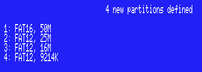
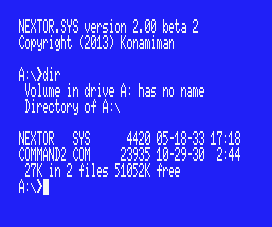
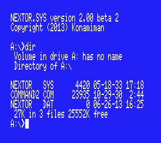
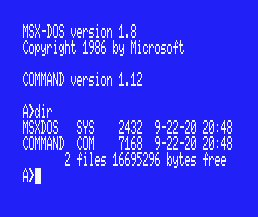
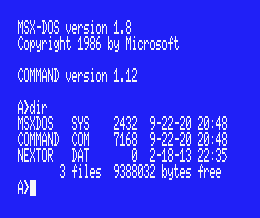
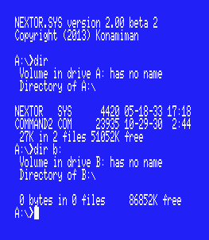
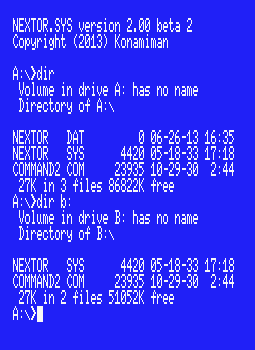
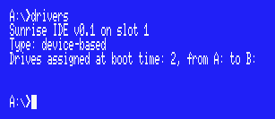

# Nextor 2.0 Getting Started Guide

## Index

[1. Introduction](#1-introduction)

[2. Setting up blueMSX](#2-setting-up-bluemsx)

[2.1. Setting up a real MSX](#21-setting-up-a-real-msx)

[3. Booting and creating partitions](#3-booting-and-creating-partitions)

[4. Mapping partitions and changing the boot partition](#4-mapping-partitions-and-changing-the-boot-partition)

[5. Booting in MSX-DOS 1 mode](#5-booting-in-msx-dos-1-mode)

[6. Using a second storage device](#6-using-a-second-storage-device)

[7. Locking drives](#7-locking-drives)

[8. The reduced/zero allocation information mode](#8-the-reducedzero-allocation-information-mode)

[9. Using the boot keys](#9-using-the-boot-keys)

[10. Change history](#10-change-history)

[10.1. v2.0.3](#101-v203)

[10.2. v2.0.2](#102-v202)

[10.3. v2.0 final](#103-v20-final)

[10.4. v2.0 Beta 2](#104-v20-beta-2)

[10.5. v2.0 Beta 1](#105-v20-beta-1)

## 1. Introduction

Nextor is an enhanced version of MSX-DOS 2, the disk operating system for MSX computers. It is based on MSX-DOS 2.31, with which it is 100% compatible.

This document provides a walkthrough of the features that Nextor adds to MSX-DOS in the form of a step-by-step guide. In order to make it easier for everyone, this guide assumes that the blueMSX emulator with will be used for the walkthrough together with an emulated Sunrise IDE controller. Users of other emulators will need to adapt the steps of _[2. Setting up blueMSX](#2-setting-up-bluemsx)_ appropriately; on the other hand, users of real MSX hardware should take a look at _[2.1. Setting up a real MSX](#21-setting-up-a-real-msx)_.

The reader of this document is assumed to have experience with MSX-DOS 2 at least at the user level. Also, It is a good idea to get acquainted with Nextor by reading _[Nextor 2.0 User Manual](Nextor%202.0%20User%20Manual.md)_ prior to (or in parallel with) this document.

Note: in this guide the following Nextor tools will be used: MAPDRV.COM, LOCK.COM and RALLOC.COM. The other tools are simple enough for not needing a step-by-step usage explanation; remember however that all the Nextor tools are explained in the _[Nextor 2.0 User Manual](Nextor%202.0%20User%20Manual.md)_ and that you can get help for any of the tools by invoking them without parameters or by issuing a TYPE command directly on the command file (for example `TYPE FASTOUT.COM`).

## 2. Setting up blueMSX

This section explains the steps needed to setup blueMSX in order to follow this guide. The blueMSX emulator can be downloaded at http://www.bluemsx.com. 

a. Download the following files from [Konamiman's MSX page](https://www.konamiman.com/msx/msx-e.html#nextor):

* Nextor kernel with Sunrise IDE driver.

* Nextor tools disk image

b. Run blueMSX and select the _Tools - Machine Editor_ menu.

c. Select the machine configuration named "MSX2".

d. Select the Memory tab and press the _Add..._ button.

e. In the Slot list select "Slot 1". In the _Type_ list select "Sunrise IDE".

f. In the _File_ box browse the Nextor kernel file you have downloaded in step a (or simply paste the whole file path). Then press the Ok button to close the window.

g. Press the _Save as..._ button and save the machine configuration with the name "MSX2 with Sunrise IDE and Nextor". Then press the Close button to close the window.

h. Select the _File - Disk Drive A - Insert_ menu. Select the Nextor tools disk image file you have downloaded in step a.

i. Select the _File - Hard Disk - IDE Sunrise Primary - Insert New Disk Image_ menu. In the _Disk Size_ list select "100 MB". Give the disk image any name you want and click the _Open_ button.

Now you have an emulated MSX2 with a Sunrise IDE controller that has the Nextor kernel in its flash ROM and a 100MB hard disk as the master device. Also, you have the Nextor utils disk in the floppy disk drive.

### 2.1. Setting up a real MSX

If you want to follow the steps of this guide by using a real MSX computer with a Sunrise IDE controller and a floppy disk drive instead of an emulator, you will need to do the following:

* Download the Nextor kernel with Sunrise IDE driver.

* Copy the NEXTOR.SYS and COMMAND2.COM files and the Nextor tools to a floppy disk. You have two options:

    * Download the Nextor tools disk image file and transfer its contents to a floppy disk.

    * Download the Nextor tools LZH file and uncompress it to a floppy disk, together with the NEXTOR.SYS and COMMAND2.COM files.

Note: The Nextor kernel, NEXTOR.SYS and the Nextor tools are available at [Konamiman's MSX page](https://www.konamiman.com/msx/msx-e.html#nextor).

* Copy the MSXDOS.SYS and COMMAND.COM files to the floppy disk, these are necessary for the steps that involve booting in MSX-DOS 1 mode. These files are included in the Nextor tools disk image file, but can be found on other places on Internet too (search for "MSXDOS.SYS" on any search engine).

* Insert the floppy disk in the drive and attach an IDE device (hard disk or compact flash card) of at least 100MB to the Sunrise IDE controller as the master device, or to the first card slot if you are using a CF reader. The device should be completely blank, that is, it should not contain any partition or filesystem; otherwise you may get different results from these described in the next section until you repartition the device.

Please note that if you use an existing IDE device, **following the steps of this guide will delete all the data on the device**.
 
## 3. Booting and creating partitions

Once all the hardware (real or emulated) is in place, now we'll see what happens when we try to boot without having defined any partition for the IDE device, then we'll create and prepare some partitions.

a. Boot your MSX. You will see that you boot in the COMMAND2 prompt in drive B:, as in the following image:


 

***What has happened?*** Nextor has assigned one drive to the Sunrise IDE driver (A:) and two drives to the floppy disk drive (B: and C:). Then it has attempted to search a suitable FAT12 or FAT16 partition in the attached hard disk in order to assign it to drive A:, but since the hard disk has no partitions yet, drive A: has been left unassigned. Drive B:, assigned to the floppy disk, is the first valid drive, and so it is used as the boot drive.

b. Type BASIC and then CALL FDISK to invoke the device partitioning tool.

c. Press "1" to select the Sunrise IDE driver, then "1" again to select the hard disk, then "1" again to select the first (and only) logical unit.

d. If you were using an already partitioned device, press "D" to delete the existing partitions.

e. Press "P" to add a partition. Type "50" to create a 50MB partition.

f. Repeat step e but this time create a 25MB partition.

g. Repeat step e but this time create a 16MB partition.

i. Press "A" to use all the remaining disk space (9214K) for yet another partition.

j. Press "S" to see the defined partitions. You should see four partitions, as in the following image:



k. Press ESC to return to the main menu, then press "W" to create the partitions on the disk. Press "y" on the data destroy warning prompt.

l. Reset your MSX. You will see that the computer boots in the BASIC prompt.
 
***What has happened?*** Nextor has assigned drive A: to the IDE controller again. However, since now the attached device has valid partitions, Nextor has assigned the first suitable partition found (the one that is 50MB big) to drive A:, so this is now the boot drive. But since the partition has not the Nextor boot files yet, the system boots in the BASIC prompt.

m. Copy the Nextor system files from the floppy disk to drive A: by executing the following commands:

```
COPY "B:NEXTOR.SYS" TO "A:"
COPY "B:COMMAND2.COM" TO "A:"
```

n. Reset your computer and you will see that now it boots in the `COMMAND2.COM` prompt from drive A:. Issue a DIR command and you should see the following (notice the 50M free space):



**NOTE:** Please be patient with the DIR command, especially if you are not using a MSX Turbo-R computer. Calculating the free space of a 50MB partition will take quite a few time to your MSX. If you are using an emulator, you can probably increase the speed of the emulated machine.
 
## 4. Mapping partitions and changing the boot partition

So far we have seen that Nextor has performed an automatic drive to partition mapping. Now we'll see how to instruct Nextor to select a different partition at boot time, and how perform manual mapping after the system has booted.

a. Assign partition 2 to drive D: by executing the following command:

    B:MAPDRV D: 2 1 1

("2" is the second partition, and "1 1" means "device index 1 controlled by driver in slot 1". Issue a `TYPE B:MAPDRV.COM` command for more details.)

b. Perform a `DIR D:` command. Check that drive D: has indeed 25MB of free space.

c. Copy the Nextor system files to drive D: with the following commands:

```
COPY NEXTOR.SYS D:
COPY COMMAND2.COM D:
```

d. Create an empty file named NEXTOR.DAT in drive D:. You can achieve this by executing a `COPY CON D:NEXTOR.DAT` command, then pressing CTRL+Z, then pressing Enter.

e. Reset your MSX, and when you are in the COMMAND2 prompt, perform a DIR command and check that this time drive A: is assigned to the second (25MB big) partition:



***What has happened?*** When performing the automatic drive to device and partition mapping assignment at boot time, Nextor normally selects the first valid (FAT12 or FAT16) partition available. But if there are partitions with a file named "NEXTOR.DAT" in the root directory, then these partition have preference in the assignment process. The contents of the NEXTOR.DAT file are irrelevant in this version of Nextor.
 
## 5. Booting in MSX-DOS 1 mode

Now we will see what happens with the automatic partition assignment process when we try to boot in MSX-DOS 1 mode.

a. Map partition 3 to drive D: by executing the following:

    B:MAPDRV D: 3 1 1

b. Copy the MSX-DOS 1 system files to drive D: by executing the following:

```
COPY B:MSXDOS.SYS D:
COPY B:COMMAND.COM D:
```

c. Reset the computer while keeping pressed the "1" key. You will boot in MSX-DOS 1 mode and in the  COMMAND.COM prompt. Issue a DIR command and you should see the following (notice the 16M free space):



***What has happened?*** When booting in MSX-DOS 1 mode, Nextor assigns one drive to the IDE driver and performs an automatic drive to device and partition assignment, as when booting in normal mode. However, this time the partitions that can't be handled in MSX-DOS 1 mode are skipped during the assignment procedure; MSX-DOS 1 can handle only FAT12 partitions with three or less sector per FAT. The first partition (50MB big) is skipped because it is FAT16. The second partition (25MB big) is skipped because it is FAT12 but has more than three sectors per FAT. Thus the third partition (16MB big) becomes the first one available, and it is then mapped to drive A:.

Remember that all partitions of 16MB or less created with the Nextor built-in partitioning tool are MSX-DOS 1 compatible.

d. Reboot the computer in normal mode again.

e. Map partition 4 to drive D: by executing the following:

    B:MAPDRV D: 4 1 1

f. Copy the MSX-DOS 1 system files to drive D: as you did in step b, then create an empty NEXTOR.DAT file in drive D: as you did in the previous section.

g. Boot the computer while keeping pressed the "1" key. You will boot in MSX-DOS 1 mode and in the  COMMAND.COM prompt again. Issue a DIR command and you should see the following (notice the 9M free space):



***What has happened?*** The rule "give priority to partitions holding a file named NEXTOR.DAT at the root directory during the automatic drive to device and partition assignment at boot time" is valid when booting in MSX-DOS 1 mode too, but this time only the MSX-DOS 1 compatible partitions are checked (partitions 3 and 4 in this case, being partition 4 the "winner" partition).

The remaining steps will leave the environment ready for the next section.

h. Boot the computer in normal mode.

i. You should have booted with partition 2 (the one 25M big) mapped to drive A:. If so, simply delete the NEXTOR.DAT file in that drive (`DEL NEXTOR.DAT`). If not, map partition 2 to drive D: (`B:MAPDRV D: 2 1 1`) and then delete the file (`DEL D:NEXTOR.DAT`).

j. Map partition 4 to drive D: and then delete the NEXTOR.DAT file.
 
## 6. Using a second storage device

Now we will see what happens when we add a second storage device to the IDE controller.

Step a applies when using the blueMSX emulator. If you are using a different emulator, you should perform the appropriate steps to attach a second 100M emulated hard disk as the slave device to the IDE controller. If you are using a real MSX, you should attach an (at least 100M big) real device configured as slave to the IDE controller, or insert an additional card in the second card slot.

a. Select the _File - Hard Disk - IDE Sunrise Secondary - Insert New Disk Image_ menu. In the _Disk Size_ list select "100 MB". Give the disk image any name you want and click the _Open_ button.

b. Reset the computer, go to BASIC and invoke the device partitioning tool with CALL FDISK.

c. Partition the device as you did in [3. Booting and creating partitions](#3-booting-and-creating-partitions). This time, however, you should select device 2 in the device selection screen; and you should create just two partitions, the first one having a size of 85M and the second one of 15M.

d. Reset the computer. Once in the COMMAND2 prompt, issue a _DIR_ command and check that drive A: has 50M free. Then issue a _DIR B:_ command and check that drive B: has 85M free (again, please be patient, especially with the second DIR command):



***What has happened?*** This time, Nextor has assigned two drives (A: and B:) to the Sunrise IDE driver, since two devices have been detected; the floppy disk controller has now drives C: and D: assigned. At boot time, Nextor assigns as many drives as devices are available to each controller (for device-based controllers only; see the _[Nextor 2.0 User Manual](Nextor%202.0%20User%20Manual.md)_ for details about the controller types).

Drive A: has been mapped to the first available partition on the first available device, as usual. However, once this has been done, Nextor has searched for more suitable partitions on additional devices to be mapped to drive B:. So drive A: is mapped to the first partition in the master device (50M big) and drive B: is mapped to the first partition in the slave device (85M big).

e. Create an empty NEXTOR.DAT file in drive B:. Also, copy the NEXTOR.SYS and COMMAND2.COM files to drive B:.

f. Reset your computer and issue a _DIR_ command, then a _DIR B:_ command. Notice that the mapping is reversed relative to the previous case (A: is mapped to the 85M partition on slave device, B: is mapped to the 50M partition on master device):



***What has happened?*** The rule "give priority to partitions holding a file named NEXTOR.DAT at the root directory during the automatic drive to device and partition assignment at boot time" applies to all partitions on all devices, not only to the first device. Taking in account both the master and the slave devices, the only partition having a NEXTOR.DAT file is the first partition on the slave device, and therefore this one is assigned to drive A:. After this is done, other devices are scanned for a partition to be mapped to drive B:; in this case the only "other device" available is the master device, and thus its first partition is mapped to drive B:.

g. Map partition 2 of slave device to drive B: (`C:MAPDRV B: 2 2 1`). Copy the MSXDOS.SYS and COMMAND.COM files to drive B:.
 
h. Reset the computer while keeping pressed the "1" key. You will boot in MSX-DOS 1 mode and in the `COMMAND.COM` prompt. Issue a `DIR` command, then a `DIR B:` command. Notice that in the first case you get 16M of free space, and in the second case you get 15M:


***What has happened?*** Drive A: has been mapped to the first available partition on the master device, and drive B: has been mapped to the first available partition on the slave device, as in the previous case. However, this time only the MSX-DOS 1 compatible partitions have been taken in account. These are partitions 3 and 4 in the master device (partition 3, 16M big, is selected) and partition 2 in the slave device (15M big).

i. Create an empty NEXTOR.DAT file in drive B:.

j. Reset the computer while keeping pressed the "1" key. You will boot in MSX-DOS 1 mode and in the `COMMAND.COM` prompt. Issue a `DIR` command, then a `DIR B:` command. Notice that the mapping is reversed relative to the previous case (A: is mapped to the 15M partition on slave device, B: is mapped to the 16M partition on master device):


***What has happened?*** You should have guessed it already: both devices have been scanned for partitions, only the MSX-DOS 1 partitions have been taken in account, and the partition having a NEXTOR.DAT file has been given priority in the mapping process and thus it has been mapped to drive A:.

k. Delete the NEXTOR.DAT from drive A:. Reset your computer in normal mode, delete the NEXTOR.DAT from drive A: again, and reset once more. You should be in the COMMAND2 prompt and have the 50M partition mapped to drive A:.
 
## 7. Locking drives

In this section we'll try the drive lock feature. 

a. Execute the following command: `C:LOCK C: ON`

b. Issue a `DIR C:` command. You will see a directory listing of the Nextor tools floppy disk.

c. Remove the floppy disk from the drive (if you are using blueMSX, select the `File - Disk Drive A - Eject: nextor.dsk` menu option).

d. Issue a `DIR C:` command again. You will see the same directory listing again instead of getting a "Not Ready" error, even though the disk has been removed from the drive.

***What has happened?*** Whenever Nextor is about to access the contents of a drive (and the drive is not mapped to a fixed device on a device-based driver), it first asks the driver if the associated storage media has changed. If the answer is "Yes" or "Not sure", then it takes the appropriate actions: for devices on a device-based driver, it assigns the first available partition on the device to the drive; for other drivers (MSX-DOS legacy drivers and drive-based drivers), it simply clears sector buffers and creates again the disk parameters block for the drive. (The "Not sure" response gets actually a special treatment; see the Nextor user manual for more details)

When a drive is locked, Nextor will never ask the driver for device change status when accessing that drive, and will instead assume that the device will never change. This improves performance as it saves both CPU processing and device access.

In this case, we have locked the floppy disk drive, whose change status would otherwise be checked on each disk access (floppy disk drives usually report a change status of "Not sure" always). When issuing the second DIR command, Nextor assumes that the disk has not changed, and since it still has the directory and FAT sectors cached in memory, it can display the disk contents even if the disk has been removed from the drive.

Nextor will clear then cached sector for a drive at the moment of locking it, therefore if you had reversed the order of steps a and b you would have effectively got a "Not Ready" error.

e. Insert the Nextor tools floppy disk in its drive again.
 
## 8. The reduced/zero allocation information mode

Now we will set the reduced allocation mode on the FAT16 partition available on each device and see what happens.

a. Reset your computer. Check that drive A: is mapped to the 50M partition on the master device, and drive B: is mapped to the 85M partition on the slave device.

b. Issue a `VOL A:50M` command, then a `VOL B:85M` command, in order to help identifying the partitions without having to rely on its free size:

 

c. Execute the following commands:

```
C:RALLOC A: ON
C:RALLOC B: ON
```

d. Issue a `DIR` command, then a `DIR B:` command. Notice that now the free space reported is 32M for both partitions:


***What has happened?*** When a drive is in reduced allocation information mode, the Nextor function ALLOC, which returns information about the total and free space on a drive and is used by `COMMAND2.COM` to display the free space, returns 32MB when the real amount is larger than this value. This may be useful when using old software that ask the operating system how much free space is available in the drive, and expect the result (in sectors) to fit in 16 bits.

e. Execute the following command:

    SET ZALLOC = ON

f. Issue again the `DIR` and `DIR B:` commands. Notice that this time the free space reported is zero for both partitions, and the DIR commands finish immediately after displaying the last file name.

***What has happened?*** When an environment item named ZALLOC exists and has the value ON (case insensitive), the reduced allocation information mode becomes the zero allocation information mode, causing the ALLOC function to return zero free space available for the drives that are in this mode. You can use this mode if you have a very large drive and/or are using a very slow device, to prevent the computer from hanging for a few seconds every time a DIR command is issued.

Note: the zero allocation information mode is available since Nextor 2.0.3.
 
## 9. Using the boot keys

We have seen that if key "1" is kept pressed while the computer is booting, Nextor starts in MSX-DOS 1 mode. Now we'll see other useful keys that can be used to alter the way Nextor boots; see the _[Nextor 2.0 User Manual](Nextor%202.0%20User%20Manual.md)_ for a full list of the available keys.

a.	Reset your computer while keeping the "3" key pressed. You will see that the computer boots in the BASIC prompt.

***What*** has happened? When the "3" key is kept pressed at boot time, Nextor ignores any NEXTOR.SYS, MSXDOS.SYS and AUTOEXEC.BAS files present in the boot drive, and boots in the MSX-BASIC prompt.

b.	Issue a `CALL SYSTEM` command.

c.	Copy the DRIVERS tool to drive A: with the following command: `COPY C:DRIVERS.COM A:`

d.	Execute the DRIVERS tool. You will see that the IDE controller had been assigned two drives at boot time, and the same happens with the floppy disk controller:


e.	Reset your computer while keeping the "CTRL" key pressed. Once in the COMMAND2.COM prompt, execute the DRIVERS tool again. You will see that both the IDE controller and the floppy disk drive have been assigned only one drive each:


***What has happened?*** When the "CTRL" key is kept pressed at boot time, Nextor will assign one single drive to Nextor drivers, regardless of the number of attached devices (for device-based controllers only; see the _[Nextor 2.0 User Manual](Nextor%202.0%20User%20Manual.md)_ for details about the controller types). The same behavior is exhibited by the floppy disk controller as usual.
 
f.	Reset your computer while keeping the "SHIFT" key pressed. Once in the COMMAND2.COM prompt, execute the DRIVERS tool again. You will see that no drives have been assigned to the floppy disk drive:



***What has happened?*** When the "SHIFT" key is kept pressed at boot time, all the storage controllers with a MSX-DOS kernel (including the floppy disk drive controller) will disable themselves, but Nextor will not. This is useful to maximize the amount of available memory, especially in MSX-DOS 1 mode, as shown in the next step. (There are boot keys to selectively disable the Nextor kernels as well; see the _[Nextor 2.0 User Manual](Nextor%202.0%20User%20Manual.md)_ for details)

g.	Reset your computer while keeping the "1" and "3" keys pressed simultaneously. Once in the BASIC prompt, issue a `PRINT FRE(0)` command. You will see that there are about 20K free for BASIC code.

h.	Reset your computer while keeping the "1", "3", "SHIFT" and "CTRL" keys pressed simultaneously. Once in the BASIC prompt, issue a `PRINT FRE(0)` command again. You will see that now the free memory is about 25K. Also, if you execute a `CALL DRVINFO` command, you will see that indeed, there is only one drive assigned:


**Note:** of course, you do not need to keep the "CTRL" key pressed while booting if you have only one device attached to your Nextor controller (unless you want to keep the floppy disk drive active but with only one drive assigned).
 
## 10. Change history

This section lists the changes in this document from previous releases. Note that this document won't be updated anymore, please look at the file history in the Git repository for newer changes.

### 10.1. v2.0.3

Added steps to test the new zero allocation information mode in section 8. The reduced/zero allocation information mode.

### 10.2. v2.0.2

There are no changes in functionality in this version, but some errata in this document has been corrected:

* References to drive C: in steps a. and m. of section 3 have been corrected to mention drive B: instead.

* Reference to drive B: in step a. of section 4 has been corrected to a reference to drive D:.

### 10.3. v2.0 final

There are no changes in functionality in this version, therefore this guide has not changed.

### 10.4. v2.0 Beta 2

* Starting at version 2.0 beta 2, Nextor no longer assigns a fixed number of two drives to device-based controllers at boot time; instead, it assigns one drive per available device. This guide has been modified accordingly.

* Section 9. Using the boot keys has been added.

### 10.5. v2.0 Beta 1

* References to Alpha changed to references to Beta.

* The drive lock test has been shortened to the floppy example only, since now a "Not sure" change status no longer implies an automatic drive mapping change (depends on the boot sector checksum).

* Changed the examples of MAPDRV.COM usage to reflect the new parameters syntax used by the tool.
