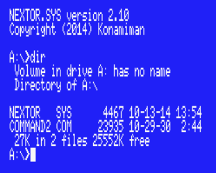
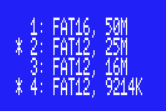
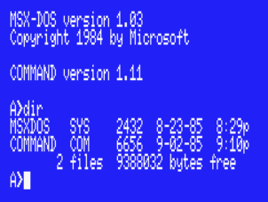
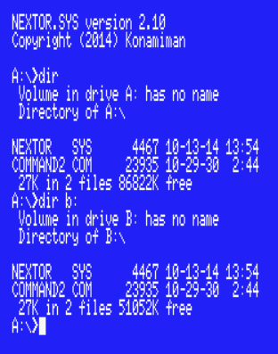
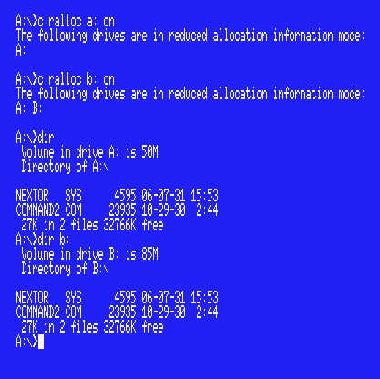

# Nextor 3.0 Getting Started Guide

## Index

[1. Introduction](#1-introduction)

[2. Setting up blueMSX](#2-setting-up-bluemsx)

[2.1. Setting up a real MSX](#21-setting-up-a-real-msx)

[3. Booting and creating partitions](#3-booting-and-creating-partitions)

[4. Mapping partitions and changing the boot partition](#4-mapping-partitions-and-changing-the-boot-partition)

[5. Booting in MSX-DOS 1 mode](#5-booting-in-msx-dos-1-mode)

[6. Using a second storage device](#6-using-a-second-storage-device)

[7. Locking drives](#7-locking-drives)

[8. The reduced/zero allocation information mode](#8-the-reducedzero-allocation-information-mode)

[9. Using the boot keys and the boot menu](#9-using-the-boot-keys-and-the-boot-menu)

[10. Installing drivers in RAM](#10-installing-drivers-in-ram)


## 1. Introduction

Nextor is an enhanced version of MSX-DOS 2, the disk operating system for MSX computers. It is based on MSX-DOS 2.31, with which it is 100% compatible.

This document provides a walkthrough of the features that Nextor adds to MSX-DOS in the form of a step-by-step guide. In order to make it easier for everyone, this guide assumes that the blueMSX emulator will be used for the walkthrough together with an emulated Sunrise IDE controller. Users of other emulators will need to adapt the steps of _[2. Setting up blueMSX](#2-setting-up-bluemsx)_ appropriately; on the other hand, users of real MSX hardware should take a look at _[2.1. Setting up a real MSX](#21-setting-up-a-real-msx)_.

The reader of this document is assumed to have experience with MSX-DOS 2 at least at the user level. Also, it is a good idea to get acquainted with Nextor by reading _[Nextor 3.0 User Manual](Nextor%203.0%20User%20Manual.md)_ prior to (or in parallel with) this document.

Note: in this guide the following Nextor tools will be used: MAPDRV.COM, LOCK.COM, RALLOC.COM, DRIVERS.COM and DRVROP.COM. The other tools are simple enough for not needing a step-by-step usage explanation; remember however that all the Nextor tools are explained in the _[Nextor 3.0 User Manual](Nextor%203.0%20User%20Manual.md)_ and that you can get help for any of the tools by invoking them without parameters or by issuing a TYPE command directly on the command file (for example `TYPE FASTOUT.COM`).

Note also that Nextor 3 features full support for floppy disk drives handled by Nextor drivers, including ghost drives and disk formatting from BASIC. The scenario used in this guide doesn't involve any Nextor floppy disk driver (the floppy disk drive is handled by its own MSX-DOS driver), so these features are not covered here; see _[2.5. Support for floppy disks](Nextor%203.0%20User%20Manual.md#25-support-for-floppy-disks)_ in the Nextor 3.0 User Manual, and try for example [the MSX Turbo-R FDD driver](https://github.com/Konamiman/TurboR-FDD-Nextor-driver) if you own (or emulate) an MSX Turbo-R.

## 2. Setting up blueMSX

This section explains the steps needed to set up blueMSX in order to follow this guide. The blueMSX emulator can be downloaded at http://www.bluemsx.com. 

a. Download the following files:

* The Nextor kernel with the Sunrise IDE driver, from [the latest release of the Sunrise IDE driver repository in GitHub](https://github.com/Konamiman/SunriseIDE-Nextor-driver/releases/latest). Starting with Nextor 3.0, the kernel files with drivers are distributed by the developer of each driver (in the case of the Sunrise IDE driver, from the releases section of its GitHub repository); see _[Nextor 3.0 Known Drivers](Nextor%203.0%20Known%20Drivers.md)_ for the complete list. Please choose the file with _.SunriseIDE.blueMSX.ROM_ extension (the _.SunriseIDE.ROM_ version works but only recognizes the slave IDE device in blueMSX), if you are using another emulator or a physical Sunrise IDE (or compatible) controller hardware you can use the file with _.SunriseIDE.ROM_ extension instead.

* The Nextor tools disk image (_tools.dsk.zip_), from [the latest release of Nextor in GitHub](https://github.com/Konamiman/Nextor/releases/latest).

b. Run blueMSX and select the _Tools - Machine Editor_ menu.

c. Select the machine configuration named "MSX2".

d. Select the Memory tab and press the _Add..._ button.

e. In the Slot list select "Slot 1". In the _Type_ list select "Sunrise IDE".

f. In the _File_ box browse the Nextor kernel file you have downloaded in step a (or simply paste the whole file path). Then press the Ok button to close the window.

g. Press the _Save as..._ button and save the machine configuration with the name "MSX2 with Sunrise IDE and Nextor". Then press the Close button to close the window.

h. Select the _File - Disk Drive A - Insert_ menu. Select the Nextor tools disk image file you have downloaded in step a.

i. Select the _File - Hard Disk - IDE Sunrise Primary - Insert New Disk Image_ menu. In the _Disk Size_ list select "100 MB". Give the disk image any name you want and click the _Open_ button.

Now you have an emulated MSX2 with a Sunrise IDE controller that has the Nextor kernel in its flash ROM and a 100MB hard disk as the master device. Also, you have the Nextor tools disk in the floppy disk drive.

### 2.1. Setting up a real MSX

If you want to follow the steps of this guide by using a real MSX computer with a Sunrise IDE controller and a floppy disk drive instead of an emulator, you will need to do the following:

* Download the Nextor kernel with Sunrise IDE driver (the file with extension _.SunriseIDE.ROM_) from [the latest release of the Sunrise IDE driver repository in GitHub](https://github.com/Konamiman/SunriseIDE-Nextor-driver/releases/latest).

* Copy the NEXTOR.SYS and COMMAND2.COM files and the Nextor tools to a floppy disk. You have two options:

    * Download the Nextor tools disk image file and transfer its contents to a floppy disk.

    * Download the Nextor tools ZIP file (_tools.zip_) and uncompress it to a floppy disk, together with the NEXTOR.SYS and COMMAND2.COM files.

Note: NEXTOR.SYS and the Nextor tools are available as assets in [the latest release of Nextor in GitHub](https://github.com/Konamiman/Nextor/releases/latest); the Nextor kernel files with the Sunrise IDE driver are released in [the Sunrise IDE driver repository](https://github.com/Konamiman/SunriseIDE-Nextor-driver/releases/latest).

* Copy the MSXDOS.SYS and COMMAND.COM files to the floppy disk, these are necessary for the steps that involve booting in MSX-DOS 1 mode. These files are included in the Nextor tools disk image file, but can be found on other places on Internet too (search for "MSXDOS.SYS" on any search engine).

* Insert the floppy disk in the drive and attach an IDE device (hard disk or compact flash card) of at least 100MB to the Sunrise IDE controller as the master device, or to the first card slot if you are using a CF reader. The device should be completely blank, that is, it should not contain any partition or filesystem; otherwise you may get different results from those described in the next section until you repartition the device.

Please note that if you use an existing IDE device, **following the steps of this guide will delete all the data on the device**.
 
## 3. Booting and creating partitions

Once all the hardware (real or emulated) is in place, now we'll see what happens when we try to boot without having defined any partition for the IDE device, then we'll create and prepare some partitions.

a. Boot your MSX. You will see that you boot in the COMMAND2 prompt in drive B:, as in the following image:


 

***What has happened?*** Nextor has assigned one drive to the Sunrise IDE driver (A:) and one drive to the floppy disk drive (B:). Then it has attempted to search a suitable FAT12 or FAT16 partition in the attached hard disk in order to assign it to drive A:, but since the hard disk has no partitions yet, drive A: has been left unassigned. Drive B:, assigned to the floppy disk, is the first valid drive, and so it is used as the boot drive.

**Note:** You may be wondering why the floppy disk drive gets only one drive letter assigned, and not two as usual. That's because by default Nextor inverts the behavior of the CTRL key at boot time. There's a way to customize this, see ["Boot key inverters" in the Nextor 3.0 User Manual](Nextor%203.0%20User%20Manual.md#2101-boot-key-inverters).

b. Type BASIC and then CALL FDISK to invoke the device partitioning tool.

c. Press "1" to select the Sunrise IDE driver, then "1" again to select the hard disk (devices are listed with the name of the storage medium they contain, together with their size).

d. If you were using an already partitioned device, press "D" and then "y" to delete the existing partitions.

e. Press "P" to add a partition, then type "50" and press ENTER to create a 50MB partition.

f. Repeat step e but this time create a 25MB partition.

g. Repeat step e but this time create a 16MB partition.

h. Press "A" to use all the remaining disk space for yet another partition (the exact size to be used is displayed as part of the menu option itself).

i. Press "S" to see the defined partitions. You should see four partitions, similar to the following image:


Note: the asterisk "*" next to the partition number means that the partition will be created with the "active" flag set in the partition table. We'll see what this implies in the next section.

j. Press ESC to return to the main menu, then press "W" to create the partitions on the disk. Press "y" on the data destroy warning prompt.

k. Reset your MSX. You will see that the computer boots in the BASIC prompt.
 
***What has happened?*** Nextor has assigned drive A: to the IDE controller again. However, since now the attached device has valid partitions, Nextor has assigned the first suitable partition found (the 50MB one, which was created with the "active" flag set) to drive A:, so this is now the boot drive. But since the partition does not have the Nextor boot files yet, the system boots in the BASIC prompt.

l. Copy the Nextor system files from the floppy disk to drive A: by executing the following commands:

```
COPY "B:NEXTOR.SYS" TO "A:"
COPY "B:COMMAND2.COM" TO "A:"
```

m. Reset your computer and you will see that now it boots in the `COMMAND2.COM` prompt from drive A:. Issue a DIR command and you should see the following (notice the 50M free space):


**NOTE:** Please be patient with the DIR command, especially if you are not using an MSX Turbo-R computer. Calculating the free space of a 50MB partition will take quite some time on your MSX. If you are using an emulator, you can probably increase the speed of the emulated machine.
 
## 4. Mapping partitions and changing the boot partition

So far we have seen that Nextor has performed an automatic drive to partition mapping. Now we'll see how to instruct Nextor to select a different partition at boot time, and how to perform manual mapping after the system has booted.

a. Assign partition 2 to drive D: by executing the following command:

    B:MAPDRV D: 2 1 1

("2" is the second partition, and "1 1" means "device index 1 controlled by driver in slot 1". Issue a `TYPE B:MAPDRV.COM` command for more details.)

b. Perform a `DIR D:` command. Check that drive D: has indeed 25MB of free space.

c. Copy the Nextor system files to drive D: with the following commands:

```
COPY NEXTOR.SYS D:
COPY COMMAND2.COM D:
```

d. Type BASIC and then CALL FDISK to invoke the device partitioning tool.

e. Press "1" to select the Sunrise IDE driver, then "1" again to select the hard disk, then "S" to show the partitions list.

f. Press "1" and then "y" to remove the "active" flag from the first partition in the partition table.

g. Press "2" and then "y" to set the "active" flag for the second partition in the partition table.

h. Reset your MSX, and when you are in the COMMAND2 prompt, perform a DIR command and check that this time drive A: is assigned to the second (25MB big) partition:



***What has happened?*** When performing the automatic drive to device and partition mapping assignment at boot time, Nextor selects the first valid (FAT12 or FAT16) partition available that has the "active" flag set in the partition table. You can set and reset this flag for any of the first 9 partitions in the device using FDISK (either partitions that you are creating, or already existing partitions).

If none of the existing partitions has the "active" flag set in the partition table, then the first suitable partition found will be mapped. We'll see this in the next section.
 
## 5. Booting in MSX-DOS 1 mode

Now we will see what happens with the automatic partition assignment process when we try to boot in MSX-DOS 1 mode.

a. Map partition 3 to drive D: by executing the following:

    B:MAPDRV D: 3 1 1

b. Copy the MSX-DOS 1 system files to drive D: by executing the following:

```
COPY B:MSXDOS.SYS D:
COPY B:COMMAND.COM D:
```

c. Reset the computer while keeping pressed the "1" key. You will boot in MSX-DOS 1 mode and in the  COMMAND.COM prompt. Issue a DIR command and you should see the following (notice the 16M free space):


***What has happened?*** When booting in MSX-DOS 1 mode, Nextor assigns one drive to the IDE driver and performs an automatic drive to device and partition assignment, as when booting in normal mode. However, this time the partitions that can't be handled in MSX-DOS 1 mode are skipped during the assignment procedure; MSX-DOS 1 can handle only FAT12 partitions with three or less sectors per FAT. The first partition (50MB big) is skipped because it is FAT16. The second partition (25MB big) is skipped because it is FAT12 but has more than three sectors per FAT. Thus the third partition (16MB big) becomes the first one available, and it is then mapped to drive A:.

Remember that all partitions of 16MB or less created with the Nextor built-in partitioning tool are MSX-DOS 1 compatible.

d. Reboot the computer in normal mode again.

e. Map partition 4 to drive D: by executing the following:

    B:MAPDRV D: 4 1 1

f. Copy the MSX-DOS 1 system files to drive D: as you did in step b

g. Go to BASIC, run FDISK and go to the partitions list for the first device, as you did in the previous section. This time set the "active" flag for partition 4. You should see that both partitions 2 and 4 are active now:



h. Boot the computer while keeping pressed the "1" key. You will boot in MSX-DOS 1 mode and in the COMMAND.COM prompt again. Issue a DIR command and you should see the following (notice the 9M free space):



***What has happened?*** The rule "give priority to partitions having the 'active' flag set during the automatic drive to device and partition assignment at boot time" is valid when booting in MSX-DOS 1 mode too, but this time only the MSX-DOS 1 compatible partitions are checked (partitions 3 and 4 in this case; partition 4 is the "winner").

The remaining steps will leave the environment ready for the next section.

i. Boot the computer in normal mode.

j. Go to BASIC, run FDISK and reset the "active" flag of both partitions 2 and 4, so that none of the partitions has the flag set.
 
## 6. Using a second storage device

Now we will see what happens when we add a second storage device to the IDE controller.

Step a applies when using the blueMSX emulator. If you are using a different emulator, you should perform the appropriate steps to attach a second 100M emulated hard disk as the slave device to the IDE controller. If you are using a real MSX, you should attach an (at least 100M big) real device configured as slave to the IDE controller, or insert an additional card in the second card slot.

a. Select the _File - Hard Disk - IDE Sunrise Secondary - Insert New Disk Image_ menu. In the _Disk Size_ list select "100 MB". Give the disk image any name you want and click the _Open_ button.

b. Reset the computer, go to BASIC and invoke the device partitioning tool with CALL FDISK.

c. Partition the device as you did in [3. Booting and creating partitions](#3-booting-and-creating-partitions). This time, however, you should select device 2 in the device selection screen; and you should create just two partitions, the first one having a size of 85M and the second one of 15M. Note that the first partition gets created with the "active" flag set (there's an asterisk next to its number in the partitions list); leave it like that.

d. Set the "active" flag on the first partition of the master device too: press ESC until you are back in the device selection screen, select device 1, press "S" to show its partitions, then press "1" and "y" to set the flag on the first (50M) partition.

e. Reset the computer. Once in the COMMAND2 prompt, issue a _DIR_ command and check that drive A: has 50M free. Then issue a _DIR B:_ command and check that drive B: has 85M free (again, please be patient, especially with the second DIR command):


***What has happened?*** This time, Nextor has assigned two drives (A: and B:) to the Sunrise IDE driver, and the floppy disk drive has now drive C: assigned. At boot time, Nextor assigns to each Nextor driver one drive per active partition found on each of the devices controlled by the driver (a device without any active partition still gets one drive); in our case each of the two devices has exactly one active partition, thus two drives. See _[3.2. Booting Nextor](Nextor%203.0%20User%20Manual.md#32-booting-nextor)_ in the Nextor 3.0 User Manual for the details.

Then, when mapping the drives, active partitions get priority and the devices are scanned in order: drive A: has been mapped to the first active partition found (the 50M one on the master device), and drive B: to the next one (the 85M one on the slave device).

**Note:** in Nextor 3, drives are mapped to partitions, not to whole devices, and nothing prevents two drives from being mapped to two partitions of the same device. If no partition had the "active" flag set, drive A: would have been mapped to the 50M partition and drive B: to the 25M partition — both on the master device!

f. Copy the NEXTOR.SYS and COMMAND2.COM files to drive B:.

g. Go to BASIC, run FDISK and remove the "active" flag of partition 1 (50M) in the master device.

h. Reset your computer and issue a _DIR_ command, then a _DIR B:_ command. Notice that the mapping is reversed relative to the previous case (A: is mapped to the 85M partition on slave device, B: is mapped to the 50M partition on master device):



***What has happened?*** The rule "give priority to partitions having the 'active' flag set during the automatic drive to device and partition assignment at boot time" applies to all partitions on all devices, not only to the first device. Taking into account both the master and the slave devices, the only partition having the "active" flag set is the first partition on the slave device, and therefore this one is assigned to drive A: (and since we copied the Nextor system files to it in step f, the system has booted from it). Drive B: has then been mapped to the first suitable partition still unassigned, which is the 50M one on the master device.

i. Map partition 2 of slave device to drive B: (`C:MAPDRV B: 2 2 1`). Copy the MSXDOS.SYS and COMMAND.COM files to drive B: (remember the floppy holding these files is now mapped in C:).
 
j. Go to BASIC, run FDISK, and set the "active" flag of partition 3 (16M) in the master device and of partition 2 (15M) in the slave device.

k. Reset the computer while keeping pressed the "1" key. You will boot in MSX-DOS 1 mode and in the `COMMAND.COM` prompt. Issue a `DIR` command, then a `DIR B:` command. Notice that in the first case you get 16M of free space, and in the second case you get 15M:


***What has happened?*** When booting in MSX-DOS 1 mode only the MSX-DOS 1 compatible partitions are taken into account, both when assigning drives to the drivers and when mapping them. The active MSX-DOS 1 compatible partitions are partition 3 (16M) on the master device and partition 2 (15M) on the slave device, and they have been mapped in that order: drive A: to the 16M one, drive B: to the 15M one. The 85M partition on the slave device has the "active" flag set too, but being FAT16 it is completely ignored in MSX-DOS 1 mode. (By the way: if you now booted in normal mode, the IDE driver would get three drives, one per active partition.)

l. Go to BASIC, run FDISK and remove the "active" flag of partition 3 (16M) in the master device.

m. Reset the computer while keeping pressed the "1" key. Once in the `COMMAND.COM` prompt, issue a `DIR` command, then a `DIR B:` command. Notice that the mapping is reversed relative to the previous case: A: is mapped to the 15M partition on the slave device, and B: is mapped to the 16M partition on the master device.

***What has happened?*** You should have guessed it already: the only active MSX-DOS 1 compatible partition is now the 15M one on the slave device, so it has been given priority and mapped to drive A:; drive B: has then been mapped to the first suitable partition still unassigned, the 16M one on the master device.

n. Go to BASIC, run FDISK and remove the "active" flag from partitions 1 and 2 of the slave device, so that none of the partitions in either device has the flag set.

o. Reset your computer in normal mode; you should be in the COMMAND2 prompt, with the 50M partition mapped to drive A: and the 25M partition mapped to drive B:.
 
## 7. Locking drives

In this section we'll try the drive lock feature. 

a. Create a small text file in the tools floppy disk. You can do that by executing `COPY CON C:TEST`, then writing something, then pressing CTRL+Z.

b. Execute the following command: `C:LOCK C: ON`

c. Execute the following: `TYPE C:TEST`. You will see the contents of the text file you just created.

d. Remove the floppy disk from the drive (if you are using blueMSX, select the `File - Disk Drive A - Eject: nextor.dsk` menu option).

e. Execute `TYPE C:TEST` again. You will see the file contents again instead of getting a "Not Ready" error, even though the disk has been removed from the drive.

***What has happened?*** Whenever Nextor is about to access the contents of a drive (this mostly matters for drives holding removable media, such as floppy disks), it first asks the driver if the associated storage media has changed. If the answer is "Yes" or "Not sure", then it takes the appropriate actions: for drives mapped to devices on Nextor drivers, it assigns the first available partition on the device to the drive; for drives handled by MSX-DOS drivers, it simply clears sector buffers and creates again the disk parameters block for the drive. (The "Not sure" response gets actually a special treatment; see _[3.3. Managing media changes](Nextor%203.0%20User%20Manual.md#33-managing-media-changes)_ in the Nextor 3.0 User Manual for more details.)

When a drive is locked, Nextor will never ask the driver for device change status when accessing that drive, and will instead assume that the device will never change. This improves performance as it saves both CPU processing and device access.

In this case, we have locked the floppy disk drive, whose change status would otherwise be checked on each disk access (floppy disk drives usually report a change status of "Not sure" always). When displaying the file contents the second time, Nextor assumes that the disk has not changed, and since it still has the file contents sector cached in memory, it can display it even if the disk has been removed from the drive.

Nextor will clear the cached sector for a drive at the moment of locking it, therefore if you had reversed the order of steps b and c you would have effectively got a "Not Ready" error.

f. Insert the Nextor tools floppy disk in its drive again.
 
## 8. The reduced/zero allocation information mode

Now we will set the reduced allocation mode on the FAT16 partition available on each device and see what happens.

a. Reset your computer. Drive A: will be mapped to the 50M partition on the master device, and drive B: to the 25M partition (also on the master device), so map drive B: to the 85M partition on the slave device by executing the following command:

    C:MAPDRV B: 1 2 1

b. Issue a `VOL A:50M` command, then a `VOL B:85M` command, in order to help identifying the partitions without having to rely on their free size:

 

c. Execute the following commands:

```
C:RALLOC A: ON
C:RALLOC B: ON
```

d. Issue a `DIR` command, then a `DIR B:` command. Notice that now the free space reported is 32M for both partitions:



***What has happened?*** When a drive is in reduced allocation information mode, the Nextor function ALLOC, which returns information about the total and free space on a drive and is used by `COMMAND2.COM` to display the free space, returns 32MB when the real amount is larger than this value. This may be useful when using old software that asks the operating system how much free space is available in the drive, and expects the result (in sectors) to fit in 16 bits.

e. Execute the following command:

    SET ZALLOC = ON

f. Issue again the `DIR` and `DIR B:` commands. Notice that this time the free space reported is zero for both partitions, and the DIR commands finish immediately after displaying the last file name.

***What has happened?*** When an environment item named ZALLOC exists and has the value ON (case insensitive), the reduced allocation information mode becomes the zero allocation information mode, causing the ALLOC function to return zero free space available for the drives that are in this mode. You can use this mode if you have a very large drive and/or are using a very slow device, to prevent the computer from hanging for a few seconds every time a DIR command is issued.

## 9. Using the boot keys and the boot menu

We have seen that if key "1" is kept pressed while the computer is booting, Nextor starts in MSX-DOS 1 mode. Now we'll see other useful keys that can be used to alter the way Nextor boots, as well as the new boot menu; see _[2.10. Boot keys and the boot menu](Nextor%203.0%20User%20Manual.md#210-boot-keys-and-the-boot-menu)_ in the Nextor 3.0 User Manual for a full list of the available keys.

a.	Reset your computer while keeping the "3" key pressed. You will see that the computer boots in the BASIC prompt.

***What has happened?*** When the "3" key is kept pressed at boot time, Nextor ignores any NEXTOR.SYS, MSXDOS.SYS and AUTOEXEC.BAS files present in the boot drive, and boots in the MSX-BASIC prompt.

b.	Issue a `CALL SYSTEM` command.

c.	Copy the DRIVERS tool to drive A: with the following command: `COPY C:DRIVERS.COM A:`

d.	Execute the DRIVERS tool. You will see that the IDE controller has been assigned two drives at boot time, and the floppy disk controller has been assigned one:


e.	Reset your computer while keeping the "5" key pressed. Once in the COMMAND2.COM prompt, execute the DRIVERS tool again. You will see that both the IDE controller and the floppy disk drive have been assigned only one drive each:


***What has happened?*** When the "5" key is kept pressed at boot time, Nextor will assign one single drive to each Nextor driver, regardless of the number of attached devices and of how many partitions have the "active" flag set.
 
f.	Reset your computer while keeping the "SHIFT" key pressed. Once in the COMMAND2.COM prompt, execute the DRIVERS tool again. You will see that no drives have been assigned to the floppy disk drive:


***What has happened?*** When the "SHIFT" key is kept pressed at boot time, all the storage controllers with an MSX-DOS kernel (including the floppy disk drive controller) will disable themselves, but Nextor will not. This is useful to maximize the amount of available memory, especially in MSX-DOS 1 mode, as shown in the next step. (There are boot keys to selectively disable the Nextor kernels as well, and the boot menu shown below can also be used for this; see _[2.10. Boot keys and the boot menu](Nextor%203.0%20User%20Manual.md#210-boot-keys-and-the-boot-menu)_ in the Nextor 3.0 User Manual for details)

g.	Reset your computer while keeping the "1" and "3" keys pressed simultaneously. Once in the BASIC prompt, issue a `PRINT FRE(0)` command. You will see that there are about 23K free for BASIC code.

h.	Reset your computer while keeping the "1", "3", "5" and "SHIFT" keys pressed simultaneously. Once in the BASIC prompt, issue a `PRINT FRE(0)` command again. You will see that now the free memory is about 25K. Also, if you execute a `CALL DRVINFO` command, you will see that indeed, there is only one drive assigned:


**Note:** of course, you do not need to keep the "5" key pressed while booting if only one drive would be assigned to your Nextor controller anyway.

i.	Reset your computer while keeping the "N" key pressed. Instead of booting, the computer will display the Nextor boot menu:


(The image shows a computer with two Nextor kernels; in the scenario of this guide only the Sunrise IDE one will be listed.)

***What has happened?*** The boot menu, introduced in Nextor 3.0, allows to configure how the system will boot without having to keep several keys pressed while the computer boots. The menu lists all the Nextor 3 kernels found in the system, and each one can be enabled or disabled for the current boot by pressing the key displayed next to it ("Q" in our case); it then lists a set of options equivalent to the boot keys we have seen in this section, which can be switched on and off by pressing the corresponding number key (an asterisk indicates the kernels and options that are currently switched on). Once you are done, press ENTER to boot applying your selection, ESC to cancel the menu and boot normally, or "N" to disable all the Nextor kernels and boot (this is useful when the kernel ROM must be updated from a storage device controlled by a non-Nextor controller). See _[2.10. Boot keys and the boot menu](Nextor%203.0%20User%20Manual.md#210-boot-keys-and-the-boot-menu)_ in the Nextor 3.0 User Manual for the details.

j.	In the boot menu, press "1" and then "5" (an asterisk will appear next to the "Boot in MSX-DOS 1 mode" and "Reduced drive allocation mode" entries), then press ENTER. You will boot in MSX-DOS 1 mode with one single drive assigned per driver, exactly as if you had kept the "1" and "5" keys pressed while the computer was booting — but this time keeping your hands free.

## 10. Installing drivers in RAM

So far all the Nextor drivers we have used were embedded in a Nextor kernel ROM. Nextor 3 introduces a new type of driver: the RAM drivers, which are loaded from a file and installed in a RAM segment of a memory mapper — no flashing involved. To try this feature we'll use the example RAM driver that is developed as part of Nextor: it implements a tiny (14K) RAM disk and, just for demonstration purposes, it also makes the CAPS LED of the computer blink and adds a CALL PRINT command to BASIC.

a. Get the example RAM driver file, _ram-driver-example.drv_ (available in [the latest release of Nextor in GitHub](https://github.com/Konamiman/Nextor/releases/latest), it can also be built from the Nextor source code), rename it to RAMDRIVR.DRV (remember that Nextor uses 8.3 format file names), and copy it to drive A:. If you are using blueMSX you can put the file in an empty folder of your computer, select the _File - Disk Drive A - Insert Directory_ menu option to use that folder as the floppy disk, execute `COPY C:RAMDRIVR.DRV A:`, and then insert the Nextor tools disk again.

b. Install the driver by executing the following command:

    C:DRVROP i RAMDRIVR.DRV /m

You will see the initialization messages printed by the driver, the slot and segment number where it has been installed (take note of these, you'll need them later), and a message telling that a drive has been mapped (drive D: if you are following this guide step by step). You will also notice that the CAPS LED of your computer (or of the emulated machine) starts blinking.

***What has happened?*** The DRVROP tool has allocated a segment from the memory mapper, loaded the driver file into it, and registered it in Nextor; from this point the driver works exactly like a driver embedded in ROM (it can even hook into the timer interrupt, hence the blinking CAPS LED). The `/m` flag has additionally mapped the first free drive letter to the first available device controlled by the new driver: a small RAM disk that lives in the driver's own RAM segment. See _[3.4.13. DRVROP: the driver operations tool](Nextor%203.0%20User%20Manual.md#3413-drvrop-the-driver-operations-tool)_ in the Nextor 3.0 User Manual for the complete syntax of the tool.

c. Issue a `DIR D:` command: you will see an empty drive with just a few kilobytes of free space. Copy a small file to it and verify that it is indeed a working drive, for example:

```
COPY C:TEST D:
DIR D:
TYPE D:TEST
```

d. Execute the DRIVERS tool (`C:DRIVERS`). The new driver ("Simple RAM disk driver") will be listed together with the drivers in ROM, showing the slot and the segment number where it is installed.

e. Type BASIC and execute `CALL PRINT("HELLO!")`: the string will be printed by the new command that the driver has added to BASIC. Go back to the DOS prompt with CALL SYSTEM.

f. Uninstall the driver by executing the following command, replacing the slot and segment numbers with the values you took note of in step b (for example, if the driver was installed in slot 3-2 and segment 4):

    C:DRVROP u 3-2 4

You will see the shutdown message printed by the driver, and the CAPS LED will stop blinking. Drive D: is now unmapped, and the CALL PRINT command is gone.

***What has happened?*** The driver has been asked to shut down (so that it could remove its hooks), all the drives mapped to it have been unmapped, and its RAM segment has been freed.

**Notes:**

* Drivers can also be installed and uninstalled from BASIC, with the commands `CALL IDRIVER("RAMDRIVR.DRV",1)` and `CALL UDRIVER(<slot>,<segment>)` respectively; see _[3.6.12. The CALL IDRIVER command](Nextor%203.0%20User%20Manual.md#3612-the-call-idriver-command)_ and _[3.6.13. The CALL UDRIVER command](Nextor%203.0%20User%20Manual.md#3613-the-call-udriver-command)_ in the Nextor 3.0 User Manual.

* RAM drivers don't work in MSX-DOS 1 mode, and they don't survive a computer reset. If you want a RAM driver to be always available, you can install it from your AUTOEXEC.BAT file.

* The example RAM driver is not the only one available: for example, [the MSX Turbo-R FDD driver](https://github.com/Konamiman/TurboR-FDD-Nextor-driver) is available in both ROM and RAM flavors.
