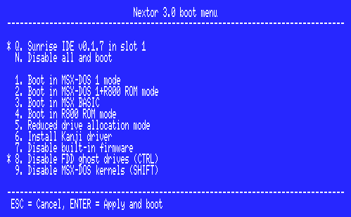

# Nextor 3.0 User Manual

## Index

[1. Introduction](#1-introduction)

[1.1. Background](#11-background)

[1.2. Goals](#12-goals)

[1.3. System requirements](#13-system-requirements)

[2. Features](#2-features)

[2.1. FAT16 filesystem support](#21-fat16-filesystem-support)

[2.2. Standardized and documented driver development system](#22-standardized-and-documented-driver-development-system)

[2.3. Drive to device/partition mapping management](#23-drive-to-devicepartition-mapping-management)

[2.4. Drive lock](#24-drive-lock)

[2.5. Support for floppy disks](#25-support-for-floppy-disks)

[2.5.1. Ghost drives](#251-ghost-drives)

[2.6. Reduced and zero allocation information mode](#26-reduced-and-zero-allocation-information-mode)

[2.7. Z80 access mode](#27-z80-access-mode)

[2.8. Fast STROUT mode](#28-fast-strout-mode)

[2.9. Extended mapper support routines](#29-extended-mapper-support-routines)

[2.10. Boot keys and the boot menu](#210-boot-keys-and-the-boot-menu)

[2.10.1. Boot key inverters](#2101-boot-key-inverters)

[2.10.2. One-time boot keys](#2102-one-time-boot-keys)

[2.11. Built-in partitioning tool](#211-built-in-partitioning-tool)

[2.12. Embedded MSX-DOS 1](#212-embedded-msx-dos-1)

[2.13. Enhanced BASIC](#213-enhanced-basic)

[2.14. Enhanced NEXTOR.SYS](#214-enhanced-nextorsys)

[2.15. File mounting and disk emulation mode](#215-file-mounting-and-disk-emulation-mode)

[2.16. The KILLDSKIO environment variable](#216-the-killdskio-environment-variable)

[3. Using Nextor](#3-using-nextor)

[3.1. Installing Nextor](#31-installing-nextor)

[3.2. Booting Nextor](#32-booting-nextor)

[3.2.1. Booting in DOS 1 mode](#321-booting-in-dos-1-mode)

[3.3. Managing media changes](#33-managing-media-changes)

[3.3.1. Media changes in MSX-DOS 1 mode](#331-media-changes-in-msx-dos-1-mode)

[3.4. The command line tools](#34-the-command-line-tools)

[3.4.1. MAPDRV: the drive mapping tool](#341-mapdrv-the-drive-mapping-tool)

[3.4.2. DRIVERS: the driver information tool](#342-drivers-the-driver-information-tool)

[3.4.3. DEVINFO: the device information tool](#343-devinfo-the-device-information-tool)

[3.4.4. DRVINFO: the drive information tool](#344-drvinfo-the-drive-information-tool)

[3.4.5. LOCK: the drive lock and unlock tool](#345-lock-the-drive-lock-and-unlock-tool)

[3.4.6. RALLOC: the reduced/zero allocation information mode tool](#346-ralloc-the-reducedzero-allocation-information-mode-tool)

[3.4.7. Z80MODE: the Z80 access mode tool](#347-z80mode-the-z80-access-mode-tool)

[3.4.8. FASTOUT: the fast STROUT mode tool](#348-fastout-the-fast-strout-mode-tool)

[3.4.9. DELALL: the partition quick format tool](#349-delall-the-partition-quick-format-tool)

[3.4.10. NSYSVER: the NEXTOR.SYS version changer](#3410-nsysver-the-nextorsys-version-changer)

[3.4.11. NEXBOOT: the one-time boot keys configuration tool](#3411-nexboot-the-one-time-boot-keys-configuration-tool)

[3.4.12. EMUFILE: the disk emulation mode tool](#3412-emufile-the-disk-emulation-mode-tool)

[3.4.13. DRVROP: the driver operations tool](#3413-drvrop-the-driver-operations-tool)

[3.4.14. One-time fix tools](#3414-one-time-fix-tools)

[3.4.15. The classic MSX-DOS tools](#3415-the-classic-msx-dos-tools)

[3.5. The built-in partitioning tool](#35-the-built-in-partitioning-tool)

[3.6. Extensions to BASIC](#36-extensions-to-basic)

[3.6.1. The DSKF command](#361-the-dskf-command)

[3.6.2. The DSKI$ and DSKO$ commands](#362-the-dski-and-dsko-commands)

[3.6.3. The CALL FORMAT command](#363-the-call-format-command)

[3.6.4. The CALL NEXTOR command](#364-the-call-nextor-command)

[3.6.5. The CALL CHDRV command](#365-the-call-chdrv-command)

[3.6.6. The CALL CURDRV command](#366-the-call-curdrv-command)

[3.6.7. The CALL DRIVERS command](#367-the-call-drivers-command)

[3.6.8. The CALL DRVINFO command](#368-the-call-drvinfo-command)

[3.6.9. The CALL LOCKDRV command](#369-the-call-lockdrv-command)

[3.6.10. The CALL MAPDRV command](#3610-the-call-mapdrv-command)

[3.6.11. The CALL MAPDRVL command](#3611-the-call-mapdrvl-command)

[3.6.12. The CALL IDRIVER command](#3612-the-call-idriver-command)

[3.6.13. The CALL UDRIVER command](#3613-the-call-udriver-command)

[3.6.14. The CALL USR command](#3614-the-call-usr-command)

[3.6.15. The CALL SYSTEM2 command](#3615-the-call-system2-command)

[3.7. New BASIC error codes](#37-new-basic-error-codes)

[3.8. Mounting files](#38-mounting-files)

[3.9. Disk emulation mode](#39-disk-emulation-mode)

[3.9.1. Entering and exiting the disk emulation mode](#391-entering-and-exiting-the-disk-emulation-mode)

[3.9.2. Changing the image file](#392-changing-the-image-file)

[3.9.3. Rules and restrictions](#393-rules-and-restrictions)

[3.9.4. How to free some memory](#394-how-to-free-some-memory)

[3.9.5. Known bugs](#395-known-bugs)

[3.10. The COMMAND3.COM command interpreter](#310-the-command3com-command-interpreter)

[3.10.1. How it is loaded](#3101-how-it-is-loaded)

[3.10.2. The new internal commands](#3102-the-new-internal-commands)

[3.10.3. The SHELLRAM command](#3103-the-shellram-command)

[3.10.4. Other changes](#3104-other-changes)

[3.10.5. Japanese messages](#3105-japanese-messages)

[4. Other improvements](#4-other-improvements)

[4.1. load" in F7](#41-load-in-f7)

[4.2. English error messages in kanji mode](#42-english-error-messages-in-kanji-mode)

[4.3. Reduced NEXTOR.SYS without Japanese error messages](#43-reduced-nextorsys-without-japanese-error-messages)


## 1. Introduction

Nextor is an enhanced version of MSX-DOS 2, the disk operating system for MSX computers. It is based on MSX-DOS 2.31, with which it is 100% compatible.

This document provides a description of the features that Nextor adds to MSX-DOS 2 and is intended primarily for end users, but it explains basic concepts that will be useful for developers as well. There are however two other documents aimed specifically at developers: _[Nextor 3.0 Programmers Reference](Nextor_3.0_Programmers_Reference.md)_ and _[Nextor 3.0 Driver Development Guide](Nextor_3.0_Driver_Development_Guide.md)_. The reader of this document is assumed to have experience with MSX-DOS 2 at least at the user level.

If you are already familiar with Nextor 2 you may want to take a look at [what's new in Nextor 3](Nextor_3.0_What's_New.md).

### 1.1. Background

MSX-DOS is the only official disk operating system for MSX computers. The last version, labeled 2.31, appeared in 1990 accompanying MSX Turbo-R computers.

MSX-DOS was developed in a time in which the only option for mass storage in MSX computers was the floppy disk, and when used as a "floppy disk only operating system" MSX-DOS works indeed just fine. Over the years, however, more modern mass storage options have appeared in the form of amateur-made hardware: from the early 1990's SCSI and IDE hard disk controllers to today's multimedia card readers. MSX-DOS has been used to manage these devices, but not without some problems:

*  MSX-DOS handles sector numbers as 16 bit entities, and the only filesystem it supports is FAT12. This limits the size of a single filesystem volume to 32MB. Unofficial patches have been developed to add support for the FAT16 filesystem.

*  The actual device driver (the code that interacts with the mass storage controller hardware) is embedded within the operating system kernel ROM, present in computers with built-in floppy disk drives and in external floppy disk controllers. There is no officially documented way (known to users and amateur developers) to embed a custom device driver within the kernel ROM; developers of custom storage controller hardware have to reverse-engineer the kernel code in order to embed a custom driver.

*  There is a fixed direct, one-to-one correspondence between the drive letters as seen by the user and the device units exposed by the device driver API. For example, in order to access drive A:, MSX-DOS asks the driver to access its first device; while the second device is queried when accessing drive B:. This is ok for floppy disks, but when using more complex devices that have one or more partitions, it is up to the driver (and usually also to external tools made by the driver developer) to manage the drive to device and partition assignment.

*  Managing non-block devices (such as CD-ROMs) is extremely difficult, as it implies a hard work of reverse-engineering on the kernel code.


### 1.2. Goals

The primary goal of Nextor is to solve the aforementioned problems, by using MSX-DOS 2 as the basis for implementing the features that are needed for an MSX computer equipped with 21st century storage devices. More specifically, the main goals of the Nextor development effort are:

*  Provide native support for the FAT16 filesystem.

*  Provide a standardized, well-documented system for developing custom storage device drivers and either embedding them within the OS kernel ROM or loading them dynamically from RAM.

*  Provide a device-based driver system (in contrast with the MSX-DOS drive-based system), so that the driver developer must only worry about enumerating and accessing storage devices and it is the operating system that manages the device- and partition-to-drive assignment.

*  Provide support for non-block devices, and for block devices with filesystems other than FAT12/16 (this is not currently implemented in Nextor, but planned for a future release).

Aside from the main goals, Nextor offers other secondary but also useful new features not present in MSX-DOS. Keep on reading for more details.

### 1.3. System requirements

Nextor will run on any MSX computer (from MSX1 onwards) having at least 128K of mapped memory. In computers with no mapped memory or having less than 128K in the largest mapper, Nextor will boot in MSX-DOS 1 mode (the DOS prompt is available only if the computer has 64K of RAM, as was the case in MSX-DOS).

You can simply burn a standalone version of Nextor (with a dummy device driver) and use it together with storage controllers associated with an MSX-DOS kernel. You will then benefit from features such as the FAT16 filesystem support or the Z80 access mode; note however that the drive to device/partition mapping management feature requires a device driver specifically made for Nextor.

## 2. Features

This section overviews the features that actually make Nextor an enhanced version of MSX-DOS 2. Operational details are provided in further sections.

### 2.1. FAT16 filesystem support

Nextor provides built-in support for the FAT16 filesystem. There is no need to install any patch, and it is perfectly possible to boot the system from a FAT16 volume. Volumes up to 4GB in size can be used.

Additionally, standard boot sectors (those present in factory-formatted or partitioned devices, or in devices formatted or partitioned by PC computers) are fully supported as well. In contrast, MSX-DOS 2 treated all disks not formatted by itself as MSX-DOS 1 disks.

### 2.2. Standardized and documented driver development system

Developers of custom storage controller hardware now have a standardized and well-documented system for developing custom drivers. The driver structure, the details about the routines to be implemented and the "recipe" for embedding the driver within the Nextor kernel are provided so that no more reverse-engineering is needed.

The driver's main purpose is to enumerate and access storage devices, but it also contains some extensibility points to add custom BASIC statements (via CALL commands), extended BIOS commands, or a timer interrupt service routine.

The following resources are available for Nextor device driver developers:

*  The _[Nextor 3.0 Driver Development Guide](Nextor_3.0_Driver_Development_Guide.md)_ document.

*  [A template driver](https://github.com/Konamiman/Nextor/tree/HEAD/sdk/templates/driver) that can be used as the skeleton for developing custom drivers.

*  A command line utility, `mknexrom`, that will do all the work of embedding a device driver within the Nextor kernel ROM. It is provided as a standard C source file, [`mknexrom.c`](https://github.com/Konamiman/Nextor/blob/HEAD/buildtools/sources/mknexrom.c), and as a prebuilt Linux executable in [the releases section](https://github.com/Konamiman/Nextor/releases).

* [A Docker image](https://github.com/Konamiman/Nextor/blob/HEAD/docker/README.md) with all the tools and kernel base files needed for generating fully usable Nextor ROM files.

In Nextor 2 drivers were always embedded in a ROM file with the Nextor kernel. Nextor 3 adds the ability to load drivers in RAM, see _[3.6.12. The CALL IDRIVER command](#3612-the-call-idriver-command)_ and _[3.4.13. DRVROP: the driver operations tool](#3413-drvrop-the-driver-operations-tool)_.

### 2.3. Drive to device/partition mapping management

MSX-DOS drivers worked by providing a one-to-one mapping between OS drive letters and driver units, which was fine in a world where floppy disks were the only widely available storage device. Nextor drivers, on the other hand, do not work in terms of driver units but directly in terms of devices. This means that the driver has no routines like "Read sector X of unit N" but rather "Return information of device X" and "Read raw data from device X". A Nextor driver can handle up to 255 devices.

The best part is that Nextor will handle the assignment of devices and partitions to drive letters, both automatically (at boot time, see _[3.2. Booting Nextor](#32-booting-nextor)_) and manually (by using a mapping utility that in turn invokes a new function call, see _[3.4.1. MAPDRV: the drive mapping tool](#341-mapdrv-the-drive-mapping-tool)_, and _[3.6.10. The CALL MAPDRV command](#3610-the-call-mapdrv-command)_). The driver developer only needs to implement raw access to the device.

Nextor 2 allowed developing the so-called "drive-based drivers", which mimicked the MSX-DOS drivers by providing a one-to-one mapping between OS drive letters and driver units, leaving the drive to device and partition mapping responsibility to the driver developer. Support for this kind of driver has been removed in Nextor 3.

### 2.4. Drive lock

Nextor allows marking drives as locked. When a drive is locked, the kernel code will not ask the driver if the media in the drive has changed; instead, it will assume that the user will never change the media. This is useful when a removable device such as a multimedia card is used as the main storage device, as it prevents the kernel from wasting time executing media verification code. Drives can be locked by using the supplied tool `LOCK.COM` or by invoking the `CALL LOCKDRV` command from within the BASIC prompt. All drives can be locked, even those belonging to MSX-DOS drivers (including floppy disk drives). See _[3.4.5. LOCK: the drive lock and unlock tool](#345-lock-the-drive-lock-and-unlock-tool)_, and _[3.6.9. The CALL LOCKDRV command](#369-the-call-lockdrv-command)_.

### 2.5. Support for floppy disks

Nextor drivers can flag the devices they control as being floppy disk drives. When that's the case, Nextor will treat these devices in a special way as follows:

* **No partitions:** Floppy disks are never partitioned. When a drive is mapped to a floppy disk device, Nextor doesn't search for partitions and maps the drive directly to the absolute sector zero of the device. Accordingly, the built-in partitioning tool will list floppy disk devices but won't allow partitioning them (see _[2.11. Built-in partitioning tool](#211-built-in-partitioning-tool)_).

* **Ghost drives:** A single floppy disk drive can be given two drive letters, so that two disks can be used "at the same time" by swapping the physical disk when prompted. See _[2.5.1. Ghost drives](#251-ghost-drives)_.

* **Formatting from BASIC:** The disk in a floppy disk drive controlled by a Nextor driver can be formatted with the `CALL FORMAT` command. This command lists all the available floppy disk drives (both those controlled by MSX-DOS drivers and those mapped to floppy disk devices on Nextor drivers) and lets you format the disk in any of them; the available format choices (for example "single side / double side") depend on the driver. Except when running in MSX-DOS 1 mode, an MSX-DOS 2 boot sector is generated on the disk after it is formatted. See _[3.6.3. The CALL FORMAT command](#363-the-call-format-command)_.

The `FORMAT` command built into `COMMAND3.COM` (the one available at the DOS prompt) can format disks in floppy disk drives controlled by both MSX-DOS and Nextor drivers. Note that the `FORMAT` command of `COMMAND2.COM` (any 2.x version) can only format disks in drives controlled by MSX-DOS drivers; that's because of changes in the disk formatting API exposed by the kernel that the old interpreter is unaware of. When using `COMMAND2.COM`, use `CALL FORMAT` from BASIC (or a custom tool) to format disks in floppy disk drives controlled by Nextor drivers.

#### 2.5.1. Ghost drives

_Ghost drives_ are a mechanism that allows using two different floppy disks "at the same time" when there's only one physical disk drive. The drive is given two drive letters: the _main_ drive and the _ghost_ drive, both referring to the same physical drive. Whenever you access one of them after having accessed the other, Nextor displays the message

```
Insert disk for drive X: and press any key
```

giving you the opportunity to swap the physical disk before the access takes place. This is the same mechanism that MSX-DOS uses to let a single floppy disk drive act as both drives A: and B:; the difference is that in Nextor it is the kernel, and not the driver, that takes care of everything (showing the disk change prompts and keeping track of which of the two drives was accessed last). A Nextor driver doesn't need to do anything special to support ghost drives: it only needs to provide the standard sector read and write routines and to flag the device as a floppy disk drive.

At any given time only one floppy disk drive can have a ghost drive assigned, and the ghost drive letter is always the one immediately following the main drive letter (for example, if C: is the main drive, then D: will be its ghost drive).

**Assignment at boot time:** When Nextor assigns a drive letter to a device at boot time, it will also assign the next drive letter as its ghost drive if all of the following are true:

* The main drive is not H: (the last possible drive letter).
* The device is flagged as a floppy disk drive by the driver.
* No other drive has been assigned as a ghost drive yet (to any device on any driver).
* The driver exposes exactly one device flagged as a floppy disk drive.

Note that in the same way as for MSX-DOS drivers, no ghost drives will be assigned to floppy disk drives controlled by Nextor drivers at boot time if the CTRL key is pressed (physically or "virtually", see _[2.10. Boot keys and the boot menu](#210-boot-keys-and-the-boot-menu)_).

**Assignment when mapping manually:** When you later map a drive letter to a device manually (for example with the MAPDRV tool or the CALL MAPDRV command, see _[3.6.10. The CALL MAPDRV command](#3610-the-call-mapdrv-command)_), the next drive letter is assigned as its ghost drive if all of the following are true:

* The main drive (the one being manually mapped) is not H:.
* The device is flagged as a floppy disk drive by the driver.
* No other drive is currently assigned as a ghost drive (to any device on any driver).
* The next drive letter is free (unassigned).
* (When running in MSX-DOS 1 mode only) the next drive letter is assigned to the same driver, but not to any device.

Unmapping the main drive automatically unmaps its ghost drive as well. Unmapping the ghost drive, on the other hand, has no effect on the main drive.

The `MAPDRV.COM` tool and the `CALL MAPDRV` command (see _[3.6.10. The CALL MAPDRV command](#3610-the-call-mapdrv-command)_) will show ghost drives identified as such.

### 2.6. Reduced and zero allocation information mode

Nextor allows setting drives in reduced allocation information mode. When in this mode, the ALLOC function, which returns information about the total and free space available in a drive, will return fake information if necessary, so that the calculated total or free sector count will always fit in 16 bits. In other words, on drives with the reduced allocation information mode active, when the total or free space is greater than 32MB (which is possible in FAT16 volumes), ALLOC will return 32MB. See _[3.4.6. RALLOC: the reduced/zero allocation information mode tool](#346-ralloc-the-reducedzero-allocation-information-mode-tool)_.

This feature is intended to avoid compatibility issues with applications that assume the underlying filesystem to be always FAT12 and therefore expect total or free space information of up to 32MB. 

If an environment item named `ZALLOC` is created with a value (case insensitive) of `ON` (command `SET ZALLOC=ON` in the command interpreter prompt), the reduced allocation information mode becomes the zero allocation information mode. In this case, ALLOC will return a free space of zero for the drives that have this mode active. This is useful because calculating the free space on a device (at the end of a DIR command, for example) may take a somewhat long time on slow and large devices (about 4 seconds in Z80 mode for an SD card, for example); when the zero allocation information mode is active, this time is reduced to zero.

### 2.7. Z80 access mode

In MSX Turbo-R computers MSX-DOS 2 always switches to the Z80 CPU when accessing a disk driver. Nextor will never change the CPU when accessing drivers attached to a Nextor kernel, but when accessing drivers attached to an MSX-DOS kernel it is possible to have the Z80 access mode active or not. When active, Nextor will switch to Z80 before accessing the driver, as MSX-DOS does. See _[3.4.7. Z80MODE: the Z80 access mode tool](#347-z80mode-the-z80-access-mode-tool)_.

The Z80 access mode is active by default for all MSX-DOS drivers. It is possible to switch it on or off on a per driver basis (it is not possible to change it for specific drive letters).

### 2.8. Fast STROUT mode

The MSX-DOS function `STROUT` prints a string terminated with a "$" character. What this function actually does is to perform one separate call to the `CONOUT` function (which prints one single character) for every character of the string.

Nextor introduces the _fast STROUT_ mode. When this mode is active, the string will be copied to a 512 byte buffer in page 3 and then it will be printed in one single call to the kernel code, which increases the speed of the printing process. The drawback is that the string length is limited to 511 bytes when this mode is active; longer strings will be truncated before being printed. See _[3.4.8. FASTOUT: the fast STROUT mode tool](#348-fastout-the-fast-strout-mode-tool)_.

### 2.9. Extended mapper support routines

MSX-DOS 2 provides a set of mapper support routines, which allow applications to allocate 16K RAM segments. Nextor maintains the original routines, but provides four new ones that allow reading data, writing data and calling routines with full slot and RAM segment number specification. See _[5. Extended mapper support routines](Nextor_3.0_Programmers_Reference.md#5-extended-mapper-support-routines)_ in the Nextor 3.0 Programmers Reference for details.

### 2.10. Boot keys and the boot menu

The boot time configuration of Nextor can be modified by keeping pressed some special keys while the system is booting. These keys and their behavior are:

*  **0**: Disable permanent disk emulation mode by deleting the emulation data file pointer from the partition table. See _[3.9. Disk emulation mode](#39-disk-emulation-mode)_.

*  **1**: Force boot in MSX-DOS 1 mode. If the computer is an MSX Turbo-R, switches the CPU to Z80 mode.

*  **2**: Force boot in MSX-DOS 1 mode. If the computer is an MSX Turbo-R, switches the CPU to R800-ROM mode. Note that in MSX-DOS 1 mode, the active CPU is never changed when accessing disk drives; this may cause some storage devices to not work properly, especially those mapped to MSX-DOS drivers such as floppy disk drives.

*  **3**: Force boot to the BASIC prompt, ignoring any existing boot code (that is, do not try to load and run `NEXTOR.SYS`, `AUTOEXEC.BAS` or the code in the boot sector).

*  **4**: (for MSX Turbo-R only) Boot in R800-ROM mode, assign the largest mapper found as the primary mapper (instead of the internal mapper), and free the 64K allocated for the R800-DRAM mode. This is useful for using software that requires a huge amount of mapped RAM and can work only with the primary mapper; note however that the R800 CPU in ROM mode is significantly slower than in DRAM mode.

*  **5**: Make Nextor assign only one drive letter per Nextor driver, instead of the normal behavior of assigning one drive per suitable active partition found (see _[3.2. Booting Nextor](#32-booting-nextor)_). Drivers are informed of this request and could act on it, see _[4.5.3. Driver query 3: Get driver initialization parameters](Nextor_3.0_Driver_Development_Guide.md#453-driver-query-3-get-driver-initialization-parameters)_.

*  **6**: Install the Kanji driver before loading the DOS environment, in the same way as disks patched with the `KMODE.COM` tool did: the equivalent of `CALL KANJI` followed by `CALL ANK` is executed in BASIC, so the driver is installed (and the memory it needs is reserved, which is very difficult to do once the DOS environment is loaded) but the screen is left in ANK mode. This works in both MSX-DOS 2 and MSX-DOS 1 modes, and the boot process just continues normally if the computer doesn't have a Kanji driver (the failure of `CALL KANJI` is silently ignored).

* **CTRL**: The state of this key is passed to MSX-DOS kernels on initialization. Typically this will cause the internal floppy disk drive to disable its second "ghost" drive, freeing some extra memory, especially in MSX-DOS 1 mode. 

*  **SHIFT**: Prevent MSX-DOS kernels from booting, but allow Nextor kernels to boot normally. This is useful to disable the internal floppy disk drive in order to get some extra TPA memory, especially in MSX-DOS 1 mode.

*  **slot key**: Prevent the Nextor kernel associated with the specified slot key from booting. This is useful when the kernel ROM must be updated from a device controlled by another Nextor controller. The associated keys for each slot are:

    * Q for primary slot 1
    * A for primary slot 2
    * QWER for slots 1-0 to 1-3, respectively
    * ASDF for slots 2-0 to 2-3, respectively
    * ZXCV for slots 3-0 to 3-3, respectively
    * In the rare event that you have a Nextor kernel at slot 0, use the keys UIOP for 0-0 to 0-3, respectively.
    
Example: if your Nextor kernel is in primary slot 1, press Q to prevent it from booting. If you have it in slot 2-3, press F.

* **N**: Shows the boot menu. This menu was introduced in Nextor 3.0, and allows you to switch on and off any of the keys listed above and then proceed with the boot, without having to keep keys pressed while the computer boots:



In the menu, the numeric keys 0 to 6 toggle the boot keys with the same numbers, while 7 toggles the CTRL key and 8 toggles the SHIFT key.

If you want to completely disable all Nextor kernels, press N at boot time to show the menu, release it, and press it again. This is useful when the kernel ROM must be updated from a storage device controlled by a non-Nextor controller (e.g. the internal floppy disk drive).

#### 2.10.1. Boot key inverters

The Nextor kernel has two bytes, at offsets 512 and 513 in the ROM, that act as _boot key inverters_. There's one bit assigned to each of the keys that affect the booting process (not including the slot keys and the 0 and N keys), and when that bit is set, then the meaning of the key is inverted. For example, if the bit for the SHIFT key is set, then MSX-DOS drivers will be disabled unless SHIFT is pressed while booting.

Being hardcoded values, the only way to customize them is to modify the Nextor ROM file before flashing it into your device. The `mknexrom` tool can be used for that, or you can do it manually using a hexadecimal editor.

Here's how bits are assigned to each key:

* First byte (offset 512):

  * Bits 1 to 6: keys 1 to 6

* Second byte (offset 513):

  * Bit 5: CTRL key
  * Bit 4: SHIFT key

All other bits are currently unused and should always be 0 to ensure compatibility with possible future extensions.

If you use `mknexrom` you need to supply a 16 bit hexadecimal value with the `/k` parameter. You should build that number by adding the values for each key as follows:

  * 1: 0002
  * 2: 0004
  * 3: 0008
  * 4: 0010
  * 5: 0020
  * 6: 0040
  * CTRL: 2000
  * SHIFT: 1000

e.g. `/k:3002` to invert the 1, CTRL and SHIFT keys, or `/k:0040` to invert the 6 key (so that the Kanji driver is installed at boot time unless the key is pressed).

The boot menu respects the key inversion encoded in the ROM, and will show inverted keys as already switched on (you can of course switch them off before continuing with the boot). For example, the boot menu screenshot displayed above is for a ROM that has the CTRL key inverted.

The releases section of the Nextor repository and the development Docker image contain "CTRL_INV" and "SHIFT_INV" variants of the kernel base file (with the CTRL and SHIFT keys inverted, respectively), as well as "KANJI_INV" variants (with the 6 key inverted) of these and of the non-inverted files; this is for convenience, especially for driver developers that don't use `mknexrom` for the build process.

#### 2.10.2. One-time boot keys

There's yet another way to modify the Nextor booting procedure: the _one-time boot keys_. If at boot time Nextor finds a certain signature at a certain position in RAM, it will read a handful of bytes following that signature and use them as the values for the boot keys (including the slot keys), ignoring the keyboard. The RAM area used is at page 2, therefore this only works on computers with at least 32K RAM.

Being a RAM based mechanism, it's "one-time" in the sense that it won't work again on the next computer reset unless the signature and the key data are put in memory again. The signature is explicitly erased by Nextor after being read to make this behavior consistent.

The `NEXBOOT.COM` tool (see _[3.4.11. NEXBOOT: the one-time boot keys configuration tool](#3411-nexboot-the-one-time-boot-keys-configuration-tool)_) can be used to easily set this data and reset the computer, but all the tool does is write to RAM, and thus any other tool could be used instead. The details on the location and format of the data used by this mechanism are in the _[Nextor 3.0 Programmers Reference](Nextor_3.0_Programmers_Reference.md)_ document.

### 2.11. Built-in partitioning tool

The Nextor kernel has a built-in device partitioning tool that can be started by just executing `CALL FDISK` in the BASIC prompt. It can be used to create partitions of any size between 100KB and 4GB on devices controlled by Nextor drivers. See _[3.5. The built-in partitioning tool](#35-the-built-in-partitioning-tool)_.

### 2.12. Embedded MSX-DOS 1

The Nextor kernel contains the MSX-DOS 1 kernel, so that it is possible to boot in this environment when necessary. The Nextor version of MSX-DOS 1 does not provide any additional functionality to users or developers relative to the original version (with a few exceptions, e.g. the `CALL FDISK` and `CALL MAPDRV` commands work); however it has been modified internally so that it can access devices attached to Nextor drivers. See _[3.2.1. Booting in DOS 1 mode](#321-booting-in-dos-1-mode)_.

### 2.13. Enhanced BASIC

The old Disk BASIC, now named simply Nextor BASIC, has been extended with new commands. Also, some of the existing commands have been improved. See _[3.6. Extensions to BASIC](#36-extensions-to-basic)_.

### 2.14. Enhanced NEXTOR.SYS

The `NEXTOR.SYS` file has been improved in several ways in Nextor 3. To begin with, its version number is now 3.0 (or higher), matching the major version number of the Nextor kernel.

Also, the resident code of `NEXTOR.SYS` is more compact than it was in Nextor 2, so slightly more free memory (TPA) is left for programs.

Also, `NEXTOR.SYS` now loads the new `COMMAND3.COM` command interpreter when it is present in the boot drive, falling back to `COMMAND2.COM` otherwise; see _[3.10. The COMMAND3.COM command interpreter](#310-the-command3com-command-interpreter)_.

Finally, when the DOS environment can't be loaded at boot time (e.g. because the command interpreter is missing or incompatible), Nextor will now print a proper error message (for example "Command interpreter not found" or "Incompatible DOS version") before falling back to the BASIC prompt, instead of repeatedly asking the user for another disk or failing silently.

### 2.15. File mounting and disk emulation mode

Since version 2.1 Nextor allows mounting disk image files in two ways:

* Booting normally and mounting a disk image file in a drive. See _[3.8. Mounting files](#38-mounting-files)_.

* Booting in disk emulation mode, so the system boots in MSX-DOS 1 mode and uses a set of disk image files (one at a time) as the boot device. See _[3.9. Disk emulation mode](#39-disk-emulation-mode)_.

### 2.16. The KILLDSKIO environment variable

Since version 2.1.1 Nextor provides a mechanism to disable the BASIC commands `DSKI$` and `DSKO$`, which gives 512 extra bytes of free memory for the BASIC environment. This is achieved by creating an environment variable named `KILLDSKIO` with a value of `ON` (case-insensitive).

Note that when `DSKI$` and `DSKO$` are disabled in this way the `DIRBUF` variable (&HF351), which holds the address of the 512 byte buffer where these commands read and write sectors, will have the same value as `SECBUF` (&HF34D), which is a generic sector buffer used internally by Nextor; and the same goes for `PATHNAM` (&HF33B), a buffer used by BASIC to parse pathnames for commands like `FILES`. This shouldn't be a problem in most cases, but for robustness it's recommended to use this feature only when that extra memory is absolutely necessary.


## 3. Using Nextor

This section explains the operational details of Nextor and the associated utilities.

### 3.1. Installing Nextor

Nextor consists of the following components:

* The Nextor kernel ROM. It must contain a device driver, although a "standalone" version is provided which contains a dummy driver exposing no devices.

* The `NEXTOR.SYS` file, which is necessary in order to boot in the DOS prompt. This file has the role that `MSXDOS2.SYS` had in MSX-DOS 2 (in fact, `NEXTOR.SYS` is just an extended version of `MSXDOS2.SYS`).

* The `COMMAND3.COM` file, the command interpreter of Nextor 3: an evolution of the MSX-DOS 2 command interpreter with new Nextor-specific internal commands (see _[3.10. The COMMAND3.COM command interpreter](#310-the-command3com-command-interpreter)_). The old `COMMAND2.COM` (any version from 2.20) can be used instead: `NEXTOR.SYS` falls back to it when `COMMAND3.COM` is not found, and in that case the Nextor-specific features must be handled by using the external command line tools.

**Note:** two variants of the NEXTOR.SYS file exist. See _[4.3. Reduced NEXTOR.SYS without Japanese error messages](#43-reduced-nextorsys-without-japanese-error-messages)_.

**Note:** COMMAND3.COM displays its messages in Japanese when the kanji mode is active. See _[3.10.5. Japanese messages](#3105-japanese-messages)_.

**Note:** starting with Nextor 2.1.0, the kernel will try to load `MSXDOS2.SYS` if `NEXTOR.SYS` is not found. However in this case the Nextor command line tools won't work.

**Note:** starting with Nextor 2.1.0, the `CALL SYSTEM2` command (see _[3.6.15. The CALL SYSTEM2 command](#3615-the-call-system2-command)_) can be used in BASIC to force a reboot in the DOS environment using `MSXDOS2.SYS`, even if `NEXTOR.SYS` exists.

In order to boot in the MSX-DOS 1 prompt, you need the usual `MSXDOS.SYS` and `COMMAND.COM` files. Also, if you have just the kernel and no `NEXTOR.SYS` or `MSXDOS.SYS` files, Nextor will boot in the BASIC prompt (running `AUTOEXEC.BAS` if present).

Therefore, in order to "install" Nextor, you have two options:

1.  Burn a ROM with the appropriate Nextor driver directly in the storage device controller.

2.  Burn a standalone version in a flash ROM cartridge, and use it together with your (MSX-DOS based) storage device controller in another slot.

Also, you need to copy at least `NEXTOR.SYS` and `COMMAND3.COM` (or `COMMAND2.COM`) to your boot device (it is recommended to have the associated utilities available as well) unless you are happy in the BASIC prompt. More details about the boot procedure follow.


### 3.2. Booting Nextor

The Nextor booting procedure is similar to the one performed by MSX-DOS 2. However, things are a little different since it is necessary to perform a drive to device and partition mapping for all the drives attached to Nextor drivers (if you are using the standalone driver only, then the booting procedure is identical to MSX-DOS 2).

At boot time, Nextor will perform a query to all the available Nextor drivers to find out how many devices are being controlled by these drivers, and will assign to each driver one drive per active partition found in each device controlled by the driver (if a device has no active partitions, it still gets one drive). If 5 is pressed at boot time, only one drive is assigned to each driver instead (see _[2.10. Boot keys and the boot menu](#210-boot-keys-and-the-boot-menu)_).

**Note:** An active partition is one that has the "active" partition flag set in its partition table entry (the most significant bit in the first byte of the partition table entry). This flag can be switched on and off for any existing partition using `FDISK`, see _[3.5. The built-in partitioning tool](#35-the-built-in-partitioning-tool)_.

For example, assume that you have two Nextor kernels attached. The kernel in slot 1 controls one device that has two active partitions, while the kernel in slot 2 controls three devices, each having either only one partition marked as active or no partitions marked as active. Then the initial drive assignment would be as follows:

```
A:, B: for driver on slot 1
C:, D:, E: for driver on slot 2
F:, G: for the internal disk drive
```

If you boot while pressing 5, the assignment will be:

```
A: for driver on slot 1
B: for driver on slot 2
C:, D: for the internal disk drive
```

The internal disk drive would not have any drives attached if you pressed SHIFT while booting (see _[2.10. Boot keys and the boot menu](#210-boot-keys-and-the-boot-menu)_) or if you use a Nextor kernel variant with the SHIFT key inverted.

After all drives have been assigned to drivers, a device and partition to drive automatic mapping procedure will be run for each of these drives. Each drive is mapped to a device partition that meets the following conditions:

1. The device doesn't have the "don't use for automapping" flag set (this flag is set by the driver).
2. Is a valid FAT12 or FAT16 partition (only FAT12 when booting in MSX-DOS 1 mode).
3. Is an active partition.

If no partitions are found that meet all three conditions, then the search is started over, but this time skipping the "is active" check; devices that already have one of their partitions mapped to another drive are skipped in this second pass, so that a device never gets more drives than the ones reserved for it (one per active partition, with a minimum of one). If this fails again, absolute sector 0 of the device is checked (to see if the device doesn't have partitions but holds a valid FAT filesystem) as a last resort.

If no suitable partition is found in any device, the drive remains attached to its device but with no partition assigned; a partition will then be searched again on the first access to the drive. This happens for devices that are offline at boot time (only if the driver declares them as removable), and for devices that are online but don't hold any valid filesystem (e.g. a brand new or not yet partitioned storage device, which this way keeps a drive attached so that it can be accessed right away after being partitioned).

The automatic mapping procedure only supports devices with numbers 1 to 63: this is a current limitation of Nextor that could disappear in future versions. In the case of a driver exposing devices with higher numbers, drives can be mapped to their partitions explicitly (see _[3.4.1. MAPDRV: the drive mapping tool](#341-mapdrv-the-drive-mapping-tool)_), but these devices won't get drives automatically.

Note that in order to speed up the booting procedure, only the first 9 partitions of each device are scanned during this procedure; consequently, FDISK (see _[3.5. The built-in partitioning tool](#35-the-built-in-partitioning-tool)_) allows changing the "active" flag on these first 9 partitions only.

After the automatic mapping is finished, the boot procedure will continue with the following steps:

1.  If the "3" key is being pressed, the system displays the BASIC prompt.

2.  Otherwise, if `NEXTOR.SYS` and a command interpreter (`COMMAND3.COM`, or `COMMAND2.COM` when the former is not found) are present in the boot drive (the first drive that is mapped to an existing partition or to sector 0 of the device), the DOS prompt is shown after `AUTOEXEC.BAT` is executed (if present). When `NEXTOR.SYS` is missing, `MSXDOS2.SYS` is loaded instead if present (see the note at the end of this section); in that case only `COMMAND2.COM` is searched for, since the `COMMAND3.COM` selection is performed by `NEXTOR.SYS` itself (and `COMMAND3.COM` would refuse to run without it anyway).

3.  Otherwise, if the boot drive has an MSX-DOS 1 or MSX-DOS 2 boot sector, its boot code is executed as in the case of MSX-DOS: first in the BASIC environment with the carry flag reset, then in the DOS environment with the carry flag set. This will usually cause `MSXDOS.SYS` and `COMMAND.COM` to be loaded if present.

4.  If the previous step returns, then the BASIC environment is activated, and `AUTOEXEC.BAS` is executed if present.

Note that step 3 will not be done if the disk has a standard boot sector (not created by MSX-DOS 1 or MSX-DOS 2). The built-in disk partitioning tool will create MSX-DOS 2 boot sectors for all partitions of 32MB or less, and standard boot sectors for larger partitions.

Starting with Nextor 2.1.0, the Nextor kernel will load `MSXDOS2.SYS` if present when `NEXTOR.SYS` is not found, thus allowing booting from old MSX-DOS 2 disks. Note however that in this case the Nextor command line tools won't work (`MSXDOS2.SYS` doesn't expose entry points for the new function calls added by Nextor).

#### 3.2.1. Booting in DOS 1 mode

The Nextor kernel can boot in MSX-DOS 1 mode. This will happen if any of the following conditions is met:

* The computer has no mapped memory, or the largest mapper has less than 128K.

* The boot drive has an MSX-DOS 1 boot sector (boot sectors not having standard format or MSX-DOS 2 format will be considered MSX-DOS 1 boot sectors).

* The "1" key or the "2" key is kept pressed while booting.

The boot procedure for MSX-DOS 1 mode is the same as for the normal (MSX-DOS 2 compatible) mode, with the following differences:

* During the automatic mapping procedure, only the MSX-DOS 1 compatible partitions will be examined. These are FAT12 partitions with three or less sectors per FAT.

* After the automatic mapping procedure, the `NEXTOR.SYS` and command interpreter search step is omitted.

* The boot sector step considers all the drives, not only drive A:, so the first drive (in drive letter order, skipping the ghost halves of ghost drive pairs, see _[2.5.1. Ghost drives](#251-ghost-drives)_) that holds a disk with a valid boot sector is booted, and it becomes the default drive, so that `MSXDOS.SYS` and `COMMAND.COM` are loaded from it. The same search is performed when entering `CALL SYSTEM` from Disk BASIC. This is unlike the original MSX-DOS 1, which could boot only from drive A:, and mimics the behavior of the normal MSX-DOS 2 compatible mode.

Partitions of 16MB or less created with the built-in disk partitioning tool will have three sectors per FAT or less, so these can be used in MSX-DOS 1 mode.

Remember that MSX-DOS 1 can boot the DOS environment (`MSXDOS.SYS` and `COMMAND.COM`) if the computer has at least 64K of RAM. Otherwise, only Disk BASIC can be used.

On MSX Turbo-R computers, the CPU mode will be switched to Z80 when booting in MSX-DOS 1 mode, unless the 2 key is pressed during boot (see _[2.10. Boot keys and the boot menu](#210-boot-keys-and-the-boot-menu)_).

Note: when booting directly in the BASIC prompt in MSX-DOS 1 mode, it is not necessary to execute `POKE &HF346,1` for `CALL SYSTEM` to work, as it was the case with the original MSX-DOS 1.

### 3.3. Managing media changes

Before trying to read or write data from a device, MSX-DOS asks the device driver if the media has changed, in order to update its internal information about the accessed filesystem. Nextor does the same, but if the drive being accessed is mapped to a Nextor driver, things get a little trickier because disk partitioning is involved.

When Nextor detects a media change in a drive mapped to a removable device on a Nextor driver, the following procedure is performed:

* The drive is mapped to the first available valid primary partition found on the device. Valid partitions are FAT12 and FAT16 partitions that aren't already mapped to other drives. If no suitable partition is found, the absolute sector zero of the device is tried as a last resort, and the drive is mapped to it if it holds a valid FAT12 or FAT16 filesystem. Otherwise the drive is left with no partition assigned: the access fails, and a new partition search is performed on each subsequent access to the drive.

* All the other drives mapped to other partitions of the same device will be left unmapped.

The device driver may also reply "not sure" when asked for device change status. In that case, the procedure is as follows:

* When Nextor first reads the boot sector of a drive mapped to a device on a Nextor driver, it calculates a 16 bit checksum of the boot sector contents and stores it together with the rest of the disk parameters.

* When Nextor asks the driver for device change status and the reply is "not sure", it re-reads the boot sector of the drive and calculates the checksum again. If it matches the previously stored checksum, Nextor assumes that the device has not been changed. Otherwise, it assumes that the device has changed and it performs the same mapping procedure as when the driver reports a device change.

It is recommended to lock drives mapped to removable devices in order to avoid unnecessary media checks (and unnecessary boot sector reads and checksum calculations).

#### 3.3.1. Media changes in MSX-DOS 1 mode

When Nextor is running in MSX-DOS 1 mode, media changes are not managed for drives mapped to Nextor drivers. For these drives, Nextor will assume that the medium never changes, and therefore will never ask the driver for change status information; if the medium is changed, it is necessary to manually inform Nextor about the change by issuing a CALL MAPDRV command from the BASIC prompt.

### 3.4. The command line tools

Nextor is supplied with a set of tools that allow managing the new capabilities available. All of these tools are `.COM` files intended to be executed from within the DOS prompt. Besides these Nextor-specific tools, the classic transient tools of MSX-DOS 2 (CHKDSK, UNDEL, DISKCOPY, FIXDISK, KMODE, XCOPY and XDIR) are supplied too, see _[3.4.15. The classic MSX-DOS tools](#3415-the-classic-msx-dos-tools)_.

This section explains how to use these tools. Note however that you can also get a summary of the parameters accepted by each tool by invoking it without parameters; more detailed help is available as well by displaying the desired file directly with the TYPE command (for example: `TYPE MAPDRV.COM`).

All the tools rely on the new function calls provided by Nextor for its behavior. If you are a developer and want to know more details, please refer to the _[Nextor 3.0 Programmers Reference](Nextor_3.0_Programmers_Reference.md)_ document.

Please note that none of these tools work in MSX-DOS 1 mode; however, there are BASIC CALL commands that provide equivalent functionality for most of the tools.

Note also that when `COMMAND3.COM` is the command interpreter, the `MAPDRV`, `DRIVERS`, `DEVINFO`, `DRVINFO`, `LOCK`, `RALLOC` and `Z80MODE` tools are available as internal commands with the same names, syntax and behavior, so the `.COM` files are not needed: typing the bare command name runs the internal version, as with any internal command (see _[3.10.2. The new internal commands](#3102-the-new-internal-commands)_). The `.COM` tools are still supplied because they also work with `COMMAND2.COM` and with older Nextor versions.

Some of the tools admit a `<driver location>` parameter. The actual syntax for this parameter is `<slot>[-<subslot>][:<segment>]|0`, with the following meaning:

- `<slot>` is the main slot number, and if the slot is extended, `<subslot>` must be provided too; e.g. `2-3` for main slot 2, subslot 3.
- If the driver is loaded in RAM, `<segment>` must be provided; e.g. `2-3:34` for slot 2, subslot 3, segment 34.
- Number 0 may be specified instead, with the meaning of "the primary Nextor controller" (which often will be the only controller present).

#### 3.4.1. MAPDRV: the drive mapping tool

`MAPDRV.COM` is a tool that allows mapping a drive letter to a partition on a device controlled by a Nextor driver. It is possible to map any drive, even those initially unmapped or associated with an MSX-DOS driver.

The usage syntax for MAPDRV is:

```
MAPDRV [/L] <drive>:
       <partition>|d|u|s
       [<device index> [<driver location>]]
```

Partition number 1 refers to the first primary partition on the device. Partitions 2 to 4 refer to extended partitions 2-1 to 2-3 if partition 2 of the device is extended, otherwise they refer to primary partitions 2 to 4. Partitions 5 onwards always refer to the extended partition 2-(P-1).

The segment number is required only when referring to a driver loaded in RAM. The rest of this section uses the word "slot" with the meaning "main slot, plus subslot and/or segment where applicable".

If partition number 0 is specified, then the drive is mapped to the absolute sector zero of the device.

There are three options for specifying the device where the partition is located:

* Do not supply any parameter after the partition number. In this case, the partition is assumed to be in the same device already mapped to the drive (this works only if the drive is currently mapped to a Nextor driver). 

* Supply a device index, but not a driver location. In this case, the partition is assumed to be in the specified device, and the device is assumed to be controlled by the kernel at the same location as the currently mapped device (this works only if the drive is currently mapped to a Nextor driver). 

* Supply a device index and a driver location. In this case, the location corresponds to the Nextor kernel that contains the driver that handles the device.

If "d" is specified instead of a partition number, then the drive will be mapped to its default state, which can be one of the following:

* If the drive was unmapped at boot time, then it is left unmapped.

* If at boot time the drive was assigned to an MSX-DOS driver unit, then it is mapped to the same unit.

* If at boot time the drive was assigned to a Nextor driver, then an automatic mapping procedure (equal to the one performed at boot time) will be performed. This may or may not result in the drive having the same mapping it had at boot time, depending on the mapping state of the other drives.

If "u" is specified instead of a partition number, then the drive will be left unmapped.

If "s" ("skip partition assignment") is specified instead of a partition number, then the drive will be mapped to the device (specified as explained above) but no partition will be assigned: the first suitable partition will be searched automatically on each access to the drive until one is found. This is useful to map a drive to a removable device that is currently offline (with a regular partition number the mapping would fail with a "Disk offline" error), or to a device that will be partitioned later.

The optional parameter "/L" locks the drive immediately after doing the mapping (recommended for removable devices that will not be changed).

Since Nextor 2.1 the MAPDRV tool can be used to mount a disk image file in a drive as well. The syntax in this case is:

```
MAPDRV <drive> <file> [/ro]
```

The `/ro` parameter will cause the file to be mounted in read-only mode. However, if the file has the read-only attribute set, it will always be mounted in read-only mode, even if no `/ro` parameter is supplied.

There are some restrictions in place when mounting files to drives. See _[3.8. Mounting files](#38-mounting-files)_ for details.


#### 3.4.2. DRIVERS: the driver information tool

The `DRIVERS.COM` utility, which is run without parameters, displays information about the available MSX-DOS and Nextor drivers. It will display the name and version (for Nextor drivers only), the slot number (with the RAM segment number for drivers loaded in RAM) and the assigned drives at boot time. MSX-DOS drivers will be identified as "Legacy MSX-DOS driver".

This tool is useful mainly to get the slot numbers of the drivers, in order to supply them as parameters to the other tools.

#### 3.4.3. DEVINFO: the device information tool

The `DEVINFO.COM` utility displays information about the devices controlled by a given Nextor driver. The information displayed includes the device index, the device type and size, and (when available) the device name, the name of the medium currently inserted in the device, the manufacturer name and the serial number.

The usage syntax for this tool is:

```
DEVINFO <driver location>
```

This tool is useful mainly to get the device indexes, in order to supply them as parameters to the MAPDRV tool.

#### 3.4.4. DRVINFO: the drive information tool

The `DRVINFO.COM` utility, which is run without parameters, displays information about all the available drive letters (those that are not unmapped). The displayed information includes the associated driver location and other information that depends on the associated driver type (driver name and version, and device number, for Nextor drivers; relative unit for MSX-DOS drivers). MSX-DOS drivers are identified as "Legacy MSX-DOS driver".

#### 3.4.5. LOCK: the drive lock and unlock tool

The `LOCK.COM` utility allows locking and unlocking drive letters. The usage syntax for LOCK is:

```
LOCK [<drive letter>: [ON|OFF]]
```

When run without parameters, a list of the drive letters currently locked is shown. If only a drive letter is specified, the current lock status for the drive is shown.

When a drive is marked as locked, Nextor will never check the media change status for the drive; instead, the inserted media is assumed to never change. This speeds up media access, but be careful since data corruption may happen if the media is changed while it is locked.

Any disk error which is aborted will automatically unlock the involved drive; other than that, drives will be unlocked only when the LOCK utility is run with the OFF parameter. Nextor will never automatically lock a drive.

#### 3.4.6. RALLOC: the reduced/zero allocation information mode tool

The `RALLOC.COM` utility allows activating or deactivating the reduced allocation information mode for a drive. The usage syntax for RALLOC is:

```
RALLOC [<drive letter>: ON|OFF]
```

If no parameters are specified, a list of drives currently in reduced allocation information mode will be shown.

When a drive is in this mode, the `ALLOC` function, which returns information about the total and free space available in a drive, will return fake information if necessary, so that the calculated total or free sector count will always fit in 16 bits. In other words, on drives with the reduced allocation information mode active, when the total or free space is greater than 32MB (which is possible in FAT16 volumes), `ALLOC` will return 32MB.

If an environment item named ZALLOC exists whose value (case insensitive) is ON (command `SET ZALLOC=ON` in the command interpreter), then the reduced allocation information mode becomes the zero allocation information mode (available since Nextor 2.0.3): the `ALLOC` function will return a free space of zero for the drives having this mode active. This makes the function return immediately, which may be useful on very large or very slow devices.

Nextor will never modify the reduced allocation information mode status for a drive automatically, it is the user who always controls this behavior. Disk errors or media changes do not modify the reduced allocation information mode status either.

#### 3.4.7. Z80MODE: the Z80 access mode tool

The `Z80MODE.COM` utility, which works on MSX Turbo-R computers only, allows activating or deactivating the Z80 access mode for an MSX-DOS driver. The usage syntax for Z80MODE is:

```
Z80MODE <driver slot>[-<driver subslot>] [ON|OFF]
```

Note that the parameter is not a full `<driver location>` because this utility doesn't work on Nextor drivers (and thus you will never provide a RAM segment number).

If only a driver slot is specified, the current Z80 access mode state for the driver will be shown. The Z80 access mode is set or unset on a per driver basis (it is not possible to change it for specific drive letters).

The Z80 access mode can be set or unset on MSX-DOS drivers only (Nextor will never switch the current CPU when accessing a Nextor driver). When set, Nextor will switch the current CPU to Z80 prior to performing any operation with the driver. When not set, Nextor will not change the current CPU when accessing the driver.

Whether a given MSX-DOS driver needs the Z80 access mode to be set or not depends on each driver; when in doubt, look at the driver documentation or ask the driver developer if at all possible. Floppy disk drives are likely to need the Z80 access mode to be active.

At boot time Nextor will activate the Z80 access mode for all MSX-DOS drivers. Other than that, Nextor will never automatically change the Z80 access mode for any driver, it is the user who always controls this behavior.


#### 3.4.8. FASTOUT: the fast STROUT mode tool

The `FASTOUT.COM` utility allows switching the fast STROUT mode on and off. The usage syntax is:

```
FASTOUT [ON|OFF]
```

When invoked without parameters, it will show the current status of the FASTOUT mode.

The MSX-DOS function `STROUT` prints a string terminated with a "$" character. What this function actually does is to perform one separate call to the CONOUT function (which prints one single character) for every character of the string.

When the fast STROUT mode is active, the string will be copied to a 512 byte buffer in page 3 and then it will be printed in one single call to the kernel code, which increases the speed of the printing process. The drawback is that the string length is limited to 511 bytes when this mode is active; longer strings will be truncated (only the first 511 characters will be displayed).

#### 3.4.9. DELALL: the partition quick format tool

The `DELALL.COM` utility will perform a quick format on the filesystem visible on a given drive letter. The usage syntax for DELALL is:

```
DELALL <drive letter>:
```

What this tool does is to clean the FAT and root directory areas of the filesystem, thus effectively deleting all the information on the filesystem. There is no way to undo the operation; the files will be permanently lost so please use with care.

This tool can be used on any drive, even those attached to MSX-DOS drivers. Note that the drive must be mapped to a valid FAT12 or FAT16 filesystem, otherwise this tool will not work.

#### 3.4.10. NSYSVER: the NEXTOR.SYS version changer

**Note:** This tool is usually necessary only when using a `NEXTOR.SYS` file whose version is 2.0 or 2.1. Current version number is 3.0 or higher (see _[2.14. Enhanced NEXTOR.SYS](#214-enhanced-nextorsys)_), so this tool shouldn't be needed anymore.

Some MSX-DOS command line applications are known to check the version number of MSXDOS2.SYS (`NEXTOR.SYS` in the case of Nextor) and refuse to work if this number is smaller than a certain value, typically 2.20. This was a problem in Nextor 2, in which the `NEXTOR.SYS` version number was 2.0 or 2.1.

As a workaround for this issue, the `NEXTOR.SYS` version number returned by the DOSVER function call is stored in RAM and can be changed easily (see the _[Nextor 3.0 Programmers Reference](Nextor_3.0_Programmers_Reference.md)_ document for more details). A command line tool that allows you to easily do this change has been created as well, its name is `NSYSVER.COM` and can be used as follows:

```
NSYSVER <major version number>.<secondary version number>
```

For example: `NSYSVER 2.20`. Note that this will change only the value of the `NEXTOR.SYS` version number returned by the `DOSVER` function call; the VER command will still display the real file version number.

Note: the version number change performed by this tool is temporary and it will cease to have effect (that is, the `NEXTOR.SYS` version number will revert to its real value) when `NEXTOR.SYS` is reloaded, either because the BASIC prompt is entered and exited via CALL SYSTEM, or because the computer is rebooted.

#### 3.4.11. NEXBOOT: the one-time boot keys configuration tool

The `NEXBOOT.COM` tool allows you to easily configure the keys to be used as one-time boot keys (see _[2.10.2. One-time boot keys](#2102-one-time-boot-keys)_) in the next reset. The syntax is:

```
NEXBOOT <boot keys>|. [*|<slot> [<slot>... ]]
```

where the boot keys are the numeric keys, C for CTRL and S for SHIFT, and `<slot>` are the slot numbers of the Nextor kernels to be disabled. The specified keys will be considered as pressed in the next boot. For example `NEXBOOT 1C` will make the 1 and CTRL keys be considered as pressed, `NEXBOOT S 1 23` will make the SHIFT key be considered as pressed and will disable the Nextor kernels in slots 1 and 2-3, and `NEXBOOT . 2` will just disable the Nextor kernel in slot 2.

When using version 1.1 or newer of NEXBOOT.COM you can also specify `*` to disable all the Nextor kernels, this is equivalent to pressing `N` in the boot menu. Note however that this will only work with Nextor kernels whose version is 2.1 or newer.

In all cases, the tool resets the computer immediately after appropriately setting the keys information in RAM.

#### 3.4.12. EMUFILE: the disk emulation mode tool

The `EMUFILE.COM` tool allows creating disk emulation mode data files and entering disk emulation mode. The syntax for creating an emulation data file is:

```
EMUFILE [<options>] <output file> <files> [<files> ...]
```

`<output file>` is the name of the emulation data file that will be created (default extension is .EMU), and `<files>` are the disk image files that will be used for the emulation (these can contain wildcards). Numbers (for disk change) are assigned to the disk image files in the same order as they are specified; when using wildcards, in the order they are found in the storage device that contains them (the same order that you see when you run the DIR command).

The `-b <number>` option allows you to specify the number of the disk image file that will be used to boot when the emulation session starts, default is 1.

The `-a <address>` option allows you to specify the page 3 address that Nextor will use as work area (about 16 bytes) during the emulation session, must be a hexadecimal number in page 3 (C000 or higher). If not specified, this area will be allocated by Nextor before starting the emulation session.

The `-p` option will print all the filenames and associated keys after creating the data file. Note however that you can see this same information afterwards if you `TYPE /B` the emulation data file.

The syntax for starting a disk emulation session is as follows:

```
EMUFILE set <data file> [o|p[<device index>[<LUN index>]]]
```

`o` will start the emulation using the one-time variant (this is the default), and `p` will start the emulation using the persistent variant. For the latter, by default the emulation file data pointer will be written to the device where `<data file>` is stored, but you can specify a different `<device index>` and also optionally a `<LUN index>`. The default LUN index is 1 (i.e. `p3` is the same as `p31`).

**Note:** The `<LUN index>` argument is unused in Nextor 3. It's still accepted by the EMUFILE tool in order to continue working in Nextor 2.

Note that in both variants the computer will reset immediately after `EMUFILE.COM` writes the emulation data file pointer to the appropriate place.

Disk emulation mode requires disk image files to be stored across consecutive clusters in the storage device. The `CONCLUS.COM` tool will check if that's the case for a given file and print an informative message; just run it as:

```
CONCLUS <file path>
```

#### 3.4.13. DRVROP: the driver operations tool

This tool allows installing and uninstalling drivers in RAM. To install a driver:

```
DRVROP i <file> [/s] [/m] [/d <data>[,<data>...]]
```

- `/s` is the silent mode flag, it skips the printing of initialization messages coming from the driver.
- `/m` will automatically map the first available drive to the first suitable device controlled by the driver (the first block device with a sector size of 512 bytes), but only if there's at least one unused drive available in the system. The drive is attached to the device with no partition assigned: the first suitable partition will be searched automatically on the first access to the drive (for devices without partitions, e.g. floppy disks, the whole device will be used).
- `/d` allows passing initialization data bytes to the driver, comma separated, and with `#` allowed as a hexadecimal prefix (e.g. `/d 1,2,#8F`). Each driver must document the meaning of the initialization data it accepts, if any. The maximum length of initialization data is 255 bytes.

To uninstall a driver already installed in RAM:

```
DRVROP u <slot>[-<subslot>] <segment> [/s]
```

You can get the slot and segment a given driver is installed on by using the `DRIVERS.COM` tool or the BASIC command `CALL DRIVERS`.

#### 3.4.14. One-time fix tools

There are a couple of extra tools that you will rarely use and are intended for one-time fix of partitions having wrong structural information: `EPTCFT.COM` (extended partition code fix tool) and `VSFT.COM` (volume size fix tool). Run them without arguments to get help on what they do and when to use them.


#### 3.4.15. The classic MSX-DOS tools

The transient tools that were part of the original MSX-DOS 2 distribution are also supplied with Nextor, rewritten and updated:

* `CHKDSK.COM` checks the integrity of the filesystem of a disk and optionally (with `/F`) fixes the errors found. It now handles FAT16 volumes besides FAT12, and requires Nextor (any version).

* `UNDEL.COM` recovers deleted files and directories, on both FAT12 and FAT16 volumes. It requires Nextor (any version).

* `DISKCOPY.COM` copies a full disk to another, sector by sector. The source and the target may now be the same drive (the copy is made in several passes, prompting to swap the disks), and by default the boot sector of the target disk is preserved (a new `/S` switch copies it from the source too).

* `FIXDISK.COM` rebuilds the MSX-DOS 2 disk parameters of a disk, preserving its files. The `/S` switch writes a complete MSX-DOS 2 boot sector instead, with a volume id (which is what enables undeletion on the disk), and the new `/B` switch (Nextor 3 or later only) writes a standard boot sector, also with a volume id.

* `KMODE.COM` sets the Kanji screen mode of the computer and, with `/S`, saves it in the boot sector of a disk so that it is set automatically at boot time. Disks with a standard boot sector are refused by `/S` (run `FIXDISK /S` on them first).

* `XCOPY.COM` copies files and directory trees, with switches for filtering, renaming, prompting and write verification. The new `/Dx` switch family controls what to do with files that already exist in the destination: overwrite, skip, keep the newer/older/smaller/bigger of the two files, overwrite only when the sizes differ, or ask for each file.

* `XDIR.COM` lists a directory and all its subdirectories recursively, with the attributes and exact size of each file, the totals and the free space on the drive. Sizes and totals of any magnitude are displayed correctly on FAT16 volumes.

All of these tools display their messages in Japanese when a Kanji screen mode is active, and in English otherwise. The tools that write disk sectors directly (`DISKCOPY`, `FIXDISK` and `KMODE /S`) work on drives handled by MSX-DOS drivers and, under Nextor 3 or later, also on drives mapped to floppy disk devices of Nextor drivers.

Except for `XDIR` (which simply lists the current directory), running any of these tools without arguments displays a usage summary instead of acting on the current drive or directory, a deliberate change from the original versions. `TYPE` on the `.COM` file displays a longer description, and the help files supplied in the tools disk (`HELP <tool name>` from the command prompt) contain the full details.


### 3.5. The built-in partitioning tool

The Nextor kernel has an embedded utility for partitioning storage devices attached to Nextor drivers. To start it, just invoke `CALL FDISK` from the BASIC prompt. It works properly in both 40-column and 80-column modes. Please note that FDISK will refuse to work if there's a BASIC program in memory (the tool uses the BASIC RAM to store its own running data).

The tool has a user interface based on menus, so you should be able to use it by just following the indications provided on the screen (when in doubt, look for an indication on what to do next in the lower line of the screen). There are however some points of interest to consider that are not mentioned in the tool itself:

* The tool allows creating up to 256 FAT12 and FAT16 partitions on any block device (excluding floppy disks) attached to a Nextor driver. MSX-DOS drivers are not supported.

* With this tool it is not possible to add new partitions to an already partitioned device. All existing partitions must be removed before defining new partitions.

* Partitions from 100KB (the minimum supported partition size) up to 32MB will be FAT12, partitions from 33MB to 4GB (the maximum supported partition size) will be FAT16.

* Partitions of 16MB or less will have three sectors per FAT or less, therefore they can be used in MSX-DOS 1 mode.

* Partitions up to 32MB will have an MSX-DOS 2 boot sector, partitions of 33MB and more will have a standard boot sector.

* To get an optimum cluster size, it is recommended to define the partition sizes as powers of two (that is: 1M, 2M, 4M, 8M, 16M or 32M for FAT12 partitions; 64M, 128M, 256M, 512M, 1G, 2G or 4G for FAT16 partitions). If this is not possible, it is better to select a partition size slightly smaller than the closest power of two rather than slightly larger (that is, for example 31M is better than 33M).

Remember that Nextor can handle devices with FAT16 partitions and standard boot sectors; if you use a factory-partitioned device of 2GB or less you probably don't need to partition it, unless you want to create MSX-DOS 1 compatible partitions (4GB devices are usually shipped with a FAT32 partition, so you will need to partition it with FDISK anyway).

When creating new partitions you can choose which one(s) will have the "active" flag set, thus being eligible for automatic mapping at boot time (see _[3.2. Booting Nextor](#32-booting-nextor)_); it is also possible to change the flag on already existing partitions.

The partitioning tool works in MSX-DOS 1 mode too. Note however that the tool will always allow you to create partitions larger than 16M, which are not compatible with MSX-DOS 1.

**Note:** FDISK supports drivers loaded in RAM too, but the driver selection page will show a maximum of nine drivers. This means that if you install a lot of drivers in RAM the last ones installed won't be accessible for partitioning.

### 3.6. Extensions to BASIC

Nextor adds some new commands to BASIC, mainly to ease the management of devices and partitions from this environment. Also, some of the commands that already existed in MSX-DOS' Disk BASIC have been extended or improved.

Some of the new CALL commands take parameters. These commands can be run without parameters in order to get help on how to use them. 

Unless otherwise stated, the Nextor modifications made to the existing Disk BASIC commands are not available in MSX-DOS 1 mode. As for the new CALL commands, only `FDISK`, `MAPDRV`, `USR`, `NEXTOR`, `CURDRV`, `CHDRV`, `DRVINFO` and `DRIVERS` are available in MSX-DOS 1 mode.

#### 3.6.1. The DSKF command

The `DSKF` command, which tells the free space available on a drive, returns a free cluster count in MSX-DOS. In Nextor the behavior of this command has been changed: now it returns a free KB count.

This behavior represents a breaking change relative to MSX-DOS. However, most of the existing programs that use this command do not actually calculate the free space count in KB, displaying the raw cluster count to the user instead. Also, for many years the most popular storage media for MSX computers has been the 2DD floppy disk, in which the cluster size is 1K, so many users were incorrectly assuming that the DSKF command was returning a KB count anyway.

This modification does not apply to MSX-DOS 1 mode, in this mode the free space is still returned as a cluster count.

The `DSKF` command will always return the real free space even if the drive has the reduced allocation information mode active. However, if the drive has the zero allocation information mode active, then the value returned will be zero.

#### 3.6.2. The DSKI$ and DSKO$ commands

The `DSKI$` function and the `DSKO$` command, which allow reading and writing one disk sector respectively, now accept 32 bit sector numbers, therefore allowing access to any drive sector, not only the first 65536 sectors.

In order to access sectors with numbers over 32767, the sector number must be specified as a single or double precision constant, expression or variable. If a single precision value is specified and the number is so big that one or more of the least significant digits of the number are lost due to truncation, these commands will fail with an "Overflow" error. This is designed this way to prevent inadvertent access to the wrong sector. For example:

```
10 DEFSNG S
20 S=12345678
30 PRINT S 'Prints "12345700"
40 PRINT DSKI$(0, S) 'Throws "Overflow"
```

The previous example will work (provided that the sector exists in the device) if line 10 is changed to `DEFDBL S`. Always use double precision variables if you are going to access arbitrary sector numbers in your BASIC code.

An "Overflow" error will be thrown too if the sector number specified does not fit in 32 bits, that is, if it is greater than 4294967295.

In order to maintain compatibility with the MSX-DOS equivalent command, negative sector numbers are accepted (to which 65536 is added to get the real sector number) but only if the sector number can be evaluated as an integer (16 bit) expression. Therefore the following commands are equivalent and will work if the sector exists in the device:

```
PRINT DSKI$(0, 65535)
PRINT DSKI$(0, &HFFFF)
PRINT DSKI$(0, -1)
DEFINT S: S=-1: PRINT DSKI$(0, S)
```

However, the following will throw a "Disk I/O error":

```
PRINT DSKI$(0, CDBL(-1))
DEFDBL S: S=-1: PRINT DSKI$(0, S)
```

None of this applies to MSX-DOS 1 mode, in this mode only integer (16 bit) sector numbers are accepted.

#### 3.6.3. The CALL FORMAT command

`CALL FORMAT` is the standard Disk BASIC command to format a floppy disk: it lists all the available floppy disk drives and, once a drive is selected, presents a numbered list of the available format choices (for example "single side / double side").

New in Nextor 3, this command also works for drives mapped to floppy disk devices handled by Nextor drivers (see _[2.5. Support for floppy disks](#25-support-for-floppy-disks)_); in that case the available format choices are supplied by the driver. The `FORMAT` command of `COMMAND3.COM` can format these drives too, but the one of the old `COMMAND2.COM` works only for drives controlled by MSX-DOS drivers.

If you are a developer, see the `_FORMAT` function call in the _[Nextor 3.0 Programmers Reference](Nextor_3.0_Programmers_Reference.md#27-_format-67h)_ document for more details.

#### 3.6.4. The CALL NEXTOR command

This command will simply display a list of the new CALL commands that Nextor provides for the BASIC environment.

#### 3.6.5. The CALL CHDRV command

This command changes the current drive and it exists already in MSX-DOS 2 Disk BASIC. However Nextor expands it in two ways:

* The command is now available in MSX-DOS 1 mode as well.

* The drive number can be specified as a number instead of a drive letter (from 1 being A: to 8 being H:). So for example `_CHDRV(3)` is the same as `_CHDRV("C:")`.

#### 3.6.6. The CALL CURDRV command

This command will simply display the current drive.

#### 3.6.7. The CALL DRIVERS command

This command is equivalent to the `DRIVERS.COM` tool, which displays information about the available MSX-DOS and Nextor drivers. It will display the name and version (for Nextor drivers only), the slot number (with the RAM segment number for drivers loaded in RAM) and the assigned drives at boot time. MSX-DOS drivers will be identified as "Legacy MSX-DOS driver".

#### 3.6.8. The CALL DRVINFO command

This command is equivalent to the `DRVINFO.COM` utility, which displays information about all the available drive letters (those that are not unmapped). The displayed information includes the associated driver slot and other information that depends on the associated driver type (driver name and version, and device number, for Nextor drivers; relative unit for MSX-DOS drivers). MSX-DOS drivers are identified as "Legacy MSX-DOS driver".

#### 3.6.9. The CALL LOCKDRV command

This command allows locking and unlocking drives (see _[2.4. Drive lock](#24-drive-lock)_ and _[3.4.5. LOCK: the drive lock and unlock tool](#345-lock-the-drive-lock-and-unlock-tool)_). It is used as follows:

```
CALL LOCKDRV(<drive>)
```

Displays the current lock status of the drive.

```
CALL LOCKDRV(<drive>, 0)
```

Unlocks the drive.

```
CALL LOCKDRV(<drive>, <any non-0 number>)
```

Locks the drive.

`<drive>` is a string with the drive letter followed by a colon (for example "A:") or a number, being 1 to 8 for drives A: to H:, or 0 for the current drive.

This command is not available in MSX-DOS 1 mode, in which the concept of "drive lock" does not exist.

#### 3.6.10. The CALL MAPDRV command

This command allows changing the drive to device and partition mapping from the BASIC environment. It is equivalent to the MAPDRV.COM tool.

The `CALL MAPDRV` syntax is explained below. Some of the parameters are optional, therefore all the possible variations are explained, starting with the most complete (using all parameters) one. Details about the possible values for each parameter are explained later.

```
CALL MAPDRV(<drive>, <partition>, <device>, <slot>[, <segment>]|0)
```

Maps the specified drive to the specified partition of the specified device, which is controlled by the driver on the specified slot (and segment, if it's a driver installed in RAM). If 0 is specified instead of a slot number, the slot of the primary controller is used.

```
CALL MAPDRV(<drive>, <partition>, <device>)
```

Maps the specified drive to the specified partition of the specified device. The driver slot is assumed to be the same as that of the device that contains the partition already mapped to the drive; if the drive is not currently mapped to a Nextor driver, an "Invalid device driver" error will be thrown.

```
CALL MAPDRV(<drive>, <partition>)
```

Maps the specified drive to the specified partition. The device is assumed to be the same one that contains the partition already mapped to the drive; if the drive is not currently mapped to a Nextor driver, an "Invalid device driver" error will be thrown.

```
CALL MAPDRV(<drive>, -1)
```

Leaves the specified drive unmapped. Further attempts to access the drive will throw a "Bad drive name" error ("Disk I/O error" in MSX-DOS 1 mode).

```
CALL MAPDRV(<drive>, -2)
CALL MAPDRV(<drive>)
```

Maps the specified drive to its default value. If at boot time the drive was unmapped or was mapped to an MSX-DOS driver, then the drive will be reverted to its original mapping state. Otherwise, an automatic mapping procedure will be performed (the procedure is equal to the one performed at boot time; see _[3.2. Booting Nextor](#32-booting-nextor)_ for more details); this may or may not result in the drive having the same mapping it had at boot time, depending on which devices are available and how the other drives are mapped.

```
CALL MAPDRV(<drive>, -3)
CALL MAPDRV(<drive>, -3, <device>)
CALL MAPDRV(<drive>, -3, <device>, <slot>[, <segment>]|0)
```

Maps the specified drive to the specified device (the device, slot and segment parameters are handled exactly as in the explicit partition mapping variants above), but skips the partition assignment: the drive is attached to the device with no partition, and the first suitable partition will be searched automatically on each access to the drive until one is found. This is useful to map a drive to a removable device that is currently offline (with a regular partition number the mapping would fail with a "Disk offline" error), or to a device that will be partitioned later.

The command parameters syntax is as follows:

* `<drive>` is a string with the drive letter followed by a colon (for example "A:") or a number, being 1 to 8 for drives A: to H:, or 0 for the current drive.

* `<partition>` is a number in the range 0-255, interpreted as follows:
    * 0: Assumes that the device has no partitions. The drive will be mapped to the absolute sector 0 of the device.
    * 1: First primary partition of the device.
    * 2, 3 or 4: If device partition 2 is extended, the number is interpreted as the first, second or third extended partition, respectively. Otherwise, the number is interpreted as the second, third or fourth primary partition of the device, respectively. 
    * 5 or greater: The number is interpreted as the (n-1)th extended partition of the device.

* `<device>` is a device index in the range 1-255.

* `<slot>` is a slot number in the range 0-3. If the slot is expanded, use the formula `<main slot>+4*<subslot>`. As a special case, if 0 is specified as the slot number and no subslot number is specified, the slot of the primary controller is used.

* `<segment>` is a RAM segment number. It's required if `<slot>` is specified and you are referring to a driver installed in RAM.

In MSX-DOS 1 mode there are some additional restrictions imposed by the Nextor architecture:

* The specified drive must have been mapped to a Nextor driver at boot time. It is not possible to change the mapping of a drive that was unmapped or mapped to an MSX-DOS driver at boot time.

* The new mapping information may specify a different partition and/or device, but the driver slot must be the same that was assigned to the drive at boot time. This is not an issue if there is only one Nextor kernel in the system.

Also, please note that in MSX-DOS 1 mode, if you map a drive to an unsupported partition type (a FAT16 partition or a FAT12 partition having more than 3 sectors per FAT) you will always get a "Disk I/O error" when accessing that drive. This does not mean that the device is actually faulty, only that Nextor refuses to access it.

Since Nextor 2.1 the CALL MAPDRV command can be used to mount a disk image file in a drive as well. The syntax in this case is:

```
CALL MAPDRV(<drive>, <file> [,0|1])
```

The `,1` parameter will cause the file to be mounted in read-only mode. However, if the file has the read-only attribute set, it will always be mounted in read-only mode, even if no `,1` parameter is supplied.

There are some restrictions in place when mounting files to drives. See _[3.8. Mounting files](#38-mounting-files)_ for details.

#### 3.6.11. The CALL MAPDRVL command

The `CALL MAPDRVL` command is identical to the `CALL MAPDRV` command, except that it will perform a drive lock (see _[2.4. Drive lock](#24-drive-lock)_ and _[3.4.5. LOCK: the drive lock and unlock tool](#345-lock-the-drive-lock-and-unlock-tool)_) immediately after changing the drive mapping.

Note that this command is not available in MSX-DOS 1 mode, in which the concept of "drive lock" does not exist.

#### 3.6.12. The CALL IDRIVER command

The `CALL IDRIVER` command can be used to install Nextor drivers in RAM. These are the syntax variants:

```
CALL IDRIVER(<filename>[,<flags>[,<data>[,<data>...]]])
CALL IDRIVER(<filename>,<flags>,<data address>,<data length>)
```

`<filename>` is the full path of the file holding the driver to load.

`<flags>` is the sum of zero or more of the following:

1: Automatically map the first available drive to the first suitable device controlled by the driver (the first block device with a sector size of 512 bytes), but only if there's at least one unused drive available in the system. The drive is attached to the device with no partition assigned: the first suitable partition will be searched automatically on the first access to the drive (for devices without partitions, e.g. floppy disks, the whole device will be used).

2: Silent mode (don't print initialization messages from the driver).

4: Use the `<data address>,<data length>` syntax for passing initialization data to the driver (if omitted, the `<data>[,<data>...]` syntax is used instead).

`<data>`: initialization data for the driver, in the form of zero or more comma-separated integer values.

`<data address>,<data length>`: address and length of a data area in memory with initialization data for the driver.

Each driver must document the meaning of the initialization data it accepts, if any. The maximum length of initialization data is 255 bytes.

**Note:** This command is not available in MSX-DOS 1 mode, where RAM drivers aren't supported.

#### 3.6.13. The CALL UDRIVER command

The `CALL UDRIVER` command can be used to uninstall a Nextor driver that has been installed in RAM with `CALL IDRIVER`, with `DRVROP.COM`, or with a custom driver install tool. The syntax is as follows:

```
CALL UDRIVER(<slot>,<segment>[,<flags>])
```

`<slot>` and `<segment>` indicate the location of the driver. If the slot is expanded, use the formula `<main slot>+4*<subslot>` (e.g. `3+4*2` for slot 3-2); there's no need to add the "expanded slot" flag bit to the slot number, it is added automatically. You can get the slot and segment a given driver is installed on by using the `DRIVERS.COM` tool or the BASIC command `CALL DRIVERS`.

`<flags>` must be either 0, or 2 for silent mode (don't print initialization messages from the driver).

**Note:** Like `CALL IDRIVER` (and RAM drivers in general), this command is not available in MSX-DOS 1 mode.

#### 3.6.14. The CALL USR command

The `CALL USR` command allows the execution of assembler code from BASIC code. It is equivalent to the standard MSX-BASIC `DEF USR` command and the USR function, but with an added feature: it allows specifying the input values of the Z80 registers for the code to execute, and reading the output values after the execution.

The syntax of the CALL USR command is as follows:

```
CALL USR(<code address> [,<registers address>])
```

`<code address>` is the address of the assembler code to be executed. Value -1 is treated as a special case: `_USR(-1)` will do nothing but will not throw an error. You can use this feature together with the `ON ERROR GOTO` command to detect the presence of Nextor from within a BASIC program.

`<registers address>` is the address of a 12 byte buffer for the Z80 registers values. If this parameter is specified, the registers will be loaded with the contents of this area before the code is invoked; after the code execution, the reverse process is performed: the buffer is updated with the values held by the registers. The order of the registers in the buffer is: F, A, C, B, E, D, L, H, IXl, IXh, IYl, IYh.

Here is a simple BASIC program to test the CALL USR command. Change the registers assignment in lines 40-90 and the address of the code to be invoked in line 100 as appropriate to invoke different code (the MSX BIOS itself is a good source of routines to play around with).

```
10 ON ERROR GOTO 20: _USR(-1): ON ERROR GOTO 0: GOTO 30
20 PRINT "Nextor not found!": END
30 DEFINT R: DIM R(12)
40 R(0)=&H2100 'AF
50 R(1)=&H3040 'BC
60 R(2)=&H5060 'DE
70 R(3)=&H7080 'HL
80 R(4)=&H90A0 'IX
90 R(5)=&HB0C0 'IY
100 CALL USR(&H00A2, VARPTR(R(0))) 'Prints a "!" (passed in A as &H21) 
110 PRINT "AF=&H";HEX$(R(0))
120 PRINT "BC=&H";HEX$(R(1))
130 PRINT "DE=&H";HEX$(R(2))
140 PRINT "HL=&H";HEX$(R(3))
150 PRINT "IX=&H";HEX$(R(4))
160 PRINT "IY=&H";HEX$(R(5))
```

#### 3.6.15. The CALL SYSTEM2 command

Nextor 2.1.1 introduced a new `CALL SYSTEM2` command. This command works the same as `CALL SYSTEM`, but will always load `MSXDOS2.SYS`, even if a file named `NEXTOR.SYS` exists. This can be useful to get back some TPA space for applications, since `MSXDOS2.SYS` is smaller than `NEXTOR.SYS`.

Note however that the new function calls introduced by Nextor won't work if `NEXTOR.SYS` isn't loaded, this implies that the Nextor-specific command line tools (e.g. `MAPDRV.COM`) won't work if the DOS environment is entered via the `CALL SYSTEM2` command.


### 3.7. New BASIC error codes

The following new BASIC error codes are defined to handle the possible errors of the new BASIC commands. Errors 76 to 79 are available in MSX-DOS 1 mode as well for the commands that work in this environment; error 80 exists in MSX-DOS 1 mode too but with a different name and meaning (see below), and errors 81 to 83 don't exist in that mode. The numbers in parentheses are the error codes.

* Invalid device driver (76), thrown by the `CALL MAPDRV` command in any of these events:

    * The specified slot number does not contain a Nextor driver.

    * No slot number is specified, but the drive is not currently mapped to a Nextor driver.

    * In MSX-DOS 1 mode, the drive was not originally mapped to a Nextor driver, or was mapped to a different driver.

* Invalid device number (77), thrown by the `CALL MAPDRV` command in any of these events:

    * The device with the specified number is not available on the specified or implicit driver.

    * The device with the specified number exists on the specified or implicit driver, but it is not a block device.

* Invalid partition number (78)

This error will be thrown by the `CALL MAPDRV` command if the specified partition does not exist on the specified or implicit device. 

* Partition already in use (79)

This error will be thrown by the `CALL MAPDRV` command if you try to map a combination of partition, device and driver that is already mapped on another drive. You can however map the same combination to the same drive again.

* File is mounted (80)

An attempt to open or alter a mounted file, or to perform any other disallowed operation involving a mounted file, has been made.

In MSX-DOS 1 mode this error code exists under the name "Illegal in emulation" and with a different meaning: an attempt has been made to change the mapping of a drive while running in disk emulation mode (files can't be mounted in MSX-DOS 1 mode at all, see _[3.8. Mounting files](#38-mounting-files)_).

* Bad file size (81)

Thrown by the `CALL MAPDRV` command when attempting to mount a file that is smaller than 512 bytes or larger than 32 MBytes.

* Cluster sequence error (82)

Thrown by the `CALL MAPDRV` command when attempting to mount a file that is not stored across consecutive sectors in its host filesystem.

* Initialization error (83)

Thrown by the `CALL IDRIVER` command when the driver's initialization routine returns an error (and thus the driver install failed).


### 3.8. Mounting files

Nextor 2.1 introduced the ability to mount disk image files on drive letters. When a disk image file is mounted, you can access its contained files and directories by using regular MSX-DOS/MSX BASIC commands and tools.

To mount a file, use the MAPDRV tool (see _[3.4.1. MAPDRV: the drive mapping tool](#341-mapdrv-the-drive-mapping-tool)_) with the `MAPDRV <drive> <file> [/ro]` syntax; or in the BASIC environment, the `CALL MAPDRV` command (see _[3.6.10. The CALL MAPDRV command](#3610-the-call-mapdrv-command)_) with the `CALL MAPDRV(<drive>, <file> [,0|1])` syntax. To unmount the file, change the mapping of the drive to anything else, or simply leave the drive unmapped (`MAPDRV <drive> U` or `CALL MAPDRV(<drive>, -1)`).

This feature has some restrictions:

* It is not available in MSX-DOS 1 mode.

* The file must have a size of at least 512 bytes and at most 32 MBytes.

* The file must be stored across consecutive sectors in its host filesystem (since Nextor 2.1.1). You can use the `CONCLUS.COM` tool to check if that's the case for a given file (see _[3.4.12. EMUFILE: the disk emulation mode tool](#3412-emufile-the-disk-emulation-mode-tool)_).

* The file is expected to contain a proper FAT filesystem already, it is not possible to apply the FORMAT command on a mounted drive. 

* The file cannot contain partitions, the contained filesystem is expected to start right at the beginning of the file.

* It is not possible to mount a file on the drive where the file itself is located:

```
MAPDRV A: A:TOOLS.DSK --> Error
```

* It is not possible to mount the same file in two drives at the same time:

```
MAPDRV B: TOOLS.DSK
MAPDRV C: TOOLS.DSK --> Error
```

* It is not possible to do a recursive file mount (mounting a file that is itself inside a mounted disk image file):

```
MAPDRV B: TOOLS.DSK
MAPDRV C: B:FILE.DSK --> Error
```

* It is not possible to alter the mapping state of a drive if it contains one or more files that are currently mounted:

```
MAPDRV B: A:TOOLS.DSK
MAPDRV A: U --> Error
```

* It is not possible to open or to alter (rename, move, delete, overwrite, change attributes) a mounted file:

```
MAPDRV B: TOOLS.DSK
TYPE TOOLS.DSK --> Error
ECHO HELLO > TOOLS.DSK --> Error
REN TOOLS.DSK X.DSK --> Error
MOVE TOOLS.DSK SOMEDIR\ --> Error
DEL TOOLS.DSK --> Error
ATTRIB +R TOOLS.DSK --> Error
```

**Note:** Currently `ECHO HELLO > TOOLS.DSK` doesn't actually throw an error due to a bug.

**Warning:** After mounting a file do not extract or swap the medium where the file is contained. The behavior of Nextor if this is done is undefined and you could lose data.


### 3.9. Disk emulation mode

Since version 2.1 Nextor allows booting in disk emulation mode. In this mode Nextor uses a disk image file (or a set of swappable files) as the boot device instead of a regular device. This is ideal for playing disks that were released on floppy disk and can't be run from a modern storage device, because they don't have a filesystem or because they need to run in MSX-DOS 1 mode.

The technical details about how the disk emulation mode works are in the _[Nextor 3.0 Programmers Reference](Nextor_3.0_Programmers_Reference.md)_ document in case you are interested in building your own tool instead of using `EMUFILE.COM`.


#### 3.9.1. Entering and exiting the disk emulation mode

First of all, the data needed during a disk emulation mode session (which disk image files will be used and where they are located) must exist in a file with a certain format, the _disk emulation data file_. You can create these files using the `EMUFILE.COM` tool (see _[3.4.12. EMUFILE: the disk emulation mode tool](#3412-emufile-the-disk-emulation-mode-tool)_). These files can have any name and will typically have the `.EMU` extension, but that's not mandatory.

Second, in order to tell Nextor to boot in disk emulation mode, a pointer to the appropriate disk emulation data file must exist at a special location while the computer boots. There are two variants of the emulation mode, each requiring a different location for the emulation data file pointer:

* **One-time:** Nextor will enter disk emulation mode only once, that is, after resetting the computer again Nextor will boot normally. In this mode the pointer to the emulation data file is set in RAM.

* **Persistent:** Nextor will enter disk emulation mode on every computer reset, until that mode is manually disabled by pressing 0 while booting. In this mode the pointer to the emulation data file is set in the partition table of one of the devices controlled by Nextor (usually the same device that contains the emulation data file and the disk image files, but that's not mandatory).

Both variants of disk emulation mode can be entered by using the `EMUFILE.COM` tool with the `set` parameter, with the one-time variant being the default.


#### 3.9.2. Changing the image file

Up to 32 disk image files can be specified for an emulation session, but only one of them is active at a given time. In order to switch to a different file, you must press the appropriate key while the computer is trying to read the file; this will emulate a disk change. The keys are 1-9 for the first nine image files, then A-W for the rest, in alphabetical order.

For example, assume that you are playing a two-disk game. You boot with disk 1 and at some point the game asks you to insert disk 2 and press the space key. Just press 2 (the key assigned to the second image file) and the space key at the same time and you're good to go.

Alternatively, you can also press the `GRAPH` key when the computer is trying to read the file. The CAPS lock LED will light up and the computer will freeze until you release `GRAPH` and press the appropriate file key (or you can press `GRAPH` again if you change your mind and want to keep using the same disk). This is useful when having to directly press an alphanumeric key while disk access is performed is a problem (for example, you are in the BASIC prompt and you want to trigger a file change when executing a FILES command: the pressed key would be added to "FILES" causing a Syntax Error).


#### 3.9.3. Rules and restrictions

The following rules and restrictions apply to the disk emulation mode:

- The primary controller must be a Nextor kernel.

- The emulation data file and all the disk image files must be placed in devices controlled by the primary controller (but they can be in different partitions and even in different devices).

- The emulation data file stores information about absolute device sectors, therefore it will be unusable if the disk image files are moved and file renames will have no effect. It is recommended to either generate the file immediately before using it, or have a partition reserved only for disk image files and their corresponding emulation data files (that is, a partition where you usually don't create or move files around).

- The disk image files must have a size of at least 512 bytes and at most 32 MBytes, must not contain partitions (the contained filesystem is expected to start right at the beginning of the file), and must contain a proper FAT12 filesystem (the `FORMAT` command will not work in disk emulation mode).

- The disk image files must not be fragmented, that is, their contents must be placed across consecutive sectors in the device.

- Disk emulation mode is always started in DOS 1 mode and in Z80 mode. If you want to start a game in R800 mode, do the following: keep `GRAPH` and 2 pressed while the computer boots, and when the CAPS LED lights up, release both keys and press 1.

- All Nextor controllers but the primary one will be disabled when disk emulation mode is entered. MSX-DOS kernels (such as the internal floppy disk drive) will not, but you can force them to disable themselves by pressing `SHIFT` while booting; this is useful to free some memory.


#### 3.9.4. How to free some memory

Some games will not work "out of the box" because they assume that only the floppy disk drive is present in the system, but now there are drives allocated for both Nextor and the floppy drive, and thus the amount of free memory is smaller. You can do the following in order to increase the amount of memory available for games:

- Press `SHIFT` while booting to disable the internal floppy disk drive (and any other MSX-DOS kernel present).

- Press 5 while booting to force Nextor to allocate only one drive for itself (useful only if you have more than one device connected to your Nextor controller). If your emulation session has five or more disk images, do the following instead: press `GRAPH`+5 until the CAPS lock LED lights up, then release both keys and press 1 (otherwise the 5 key would also be read as a request to switch to the fifth disk image).


#### 3.9.5. Known bugs

* The current version of the `EMUFILE.COM` tool does not verify that the disk image files are not fragmented (but you can use the `CONCLUS.COM` tool for this).

* If you have more than one device in the primary Nextor controller (for example, for the MegaFlashROM SCC+ SD this means two SD cards, or one or two cards plus the ROM disk), Nextor will allocate one dummy drive letter for each extra device. MSX-DOS devices (if any) will then have drive letters assigned after these. For example, if you have three devices, A: is where the emulated disk image file is mounted, B: and C: are dummy, and D: is the internal floppy disk drive. These dummy drives will NOT have memory allocated for FAT buffers.


### 3.10. The COMMAND3.COM command interpreter

Nextor 3 comes with its own command interpreter: `COMMAND3.COM`. It is based on COMMAND 2.44, of which it keeps all the features (internal commands, aliases, command line editing and history, batch file enhancements, environment items, the HELP command, etc.), and adds functionality specific to Nextor 3, described in the following sections.

`COMMAND3.COM` requires a Nextor 3 kernel and version 3 of `NEXTOR.SYS`: when run on an older Nextor or plain MSX-DOS 2 system it prints a "Wrong version of Nextor" message and drops to the BASIC prompt.

The complete reference for every command is available through the `HELP` command; the help files are supplied in the `HELP` directory of the Nextor tools disk, and are found automatically when the system boots from that disk (for other locations, point the `HELP` environment item to the directory holding the files, e.g. `SET HELP=C:\HELP`). Alternatively, you can read them directly in [the help files directory in this repository](https://github.com/Konamiman/Nextor/tree/HEAD/source/commandcom/helpfiles).

#### 3.10.1. How it is loaded

At boot time `NEXTOR.SYS` searches the boot drive for `COMMAND3.COM` first, and falls back to `COMMAND2.COM` when it is not found. Any version of `COMMAND2.COM` from 2.20 works with Nextor 3; the features described in this section are simply not available with it, and the Nextor-specific functionality must be handled with the external command line tools instead (see _[3.4. The command line tools](#34-the-command-line-tools)_).

#### 3.10.2. The new internal commands

The following Nextor command line tools are now also internal commands of `COMMAND3.COM`, with the same names, syntax and behavior; typing the bare command name runs the internal version, no `.COM` file needed:

* `MAPDRV`: maps a drive letter to a partition of a device, or mounts a disk image file on a drive (see _[3.4.1. MAPDRV: the drive mapping tool](#341-mapdrv-the-drive-mapping-tool)_).

* `DRIVERS`: displays the device drivers present in the system (see _[3.4.2. DRIVERS: the driver information tool](#342-drivers-the-driver-information-tool)_).

* `DEVINFO`: displays the devices handled by a driver (see _[3.4.3. DEVINFO: the device information tool](#343-devinfo-the-device-information-tool)_).

* `DRVINFO`: displays what every drive letter is assigned to (see _[3.4.4. DRVINFO: the drive information tool](#344-drvinfo-the-drive-information-tool)_).

* `LOCK`: locks and unlocks drives (see _[3.4.5. LOCK: the drive lock and unlock tool](#345-lock-the-drive-lock-and-unlock-tool)_).

* `RALLOC`: displays and sets the reduced allocation information mode (see _[3.4.6. RALLOC: the reduced/zero allocation information mode tool](#346-ralloc-the-reducedzero-allocation-information-mode-tool)_).

* `Z80MODE`: displays and sets the Z80 access mode of a legacy driver (see _[3.4.7. Z80MODE: the Z80 access mode tool](#347-z80mode-the-z80-access-mode-tool)_).

Additionally, there are two brand new internal commands:

* `MEM`: displays a compact memory mapper listing: one line per mapper with its slot and its total, reserved and free memory, followed by the totals, the RAM disk size (when one exists) and the end address and size of the TPA. For more detailed information the classic `MEMORY` command is still there.

* `SHELLRAM`: enables or disables the usage of an extra RAM segment by `COMMAND3.COM`, see below for the details.

#### 3.10.3. The SHELLRAM command

Like COMMAND 2.40 and later, `COMMAND3.COM` normally allocates one 16K RAM segment of the mapped RAM, and uses it to keep the command history, the alias list and its own state while transient programs execute. The new `SHELLRAM` internal command controls this behavior at run time:

* `SHELLRAM` (no parameters) displays the current state.

* `SHELLRAM OFF` gives the RAM segment back to the system, for users who need every RAM segment they can get for some other program. This has a price: the command history, the aliases and the `%_SHELL%` variable stop working (`ALIAS`, `HISTORY` and `MEMORY` report "Shell RAM is off"), and the TPA shrinks by about 1K, which the interpreter uses to save its state below its resident code, as the interpreter versions older than 2.40 did.

* `SHELLRAM ON` returns to the normal state, allocating a RAM segment again. The command history and the alias list come back empty, unless a segment left over from a previous shell could be adopted. If no free segment exists, "Not enough memory" is reported and nothing changes.

The state is recorded in the `SHELLRAM` environment item, which is read when the interpreter starts: the chosen state survives entering the BASIC interpreter and coming back with `CALL SYSTEM`. Setting the item directly (`SET SHELLRAM=OFF`) works too, taking effect the next time the interpreter is loaded.

When no free RAM segment exists at the time the interpreter starts, it silently starts with the shell RAM off instead of refusing to run. This automatic fallback is not recorded in the environment item, so the normal state is attempted again on the next start; put a `SHELLRAM` invocation in your `AUTOEXEC.BAT` if you want to see the resulting state at boot time.

The state can not be changed from a shell that shares its RAM segment with an outer shell (a secondary shell started with its own free segment available manages its own state normally).

#### 3.10.4. Other changes

Compared to COMMAND 2.44:

* The `FORMAT` command now works for drives mapped to floppy disk devices handled by Nextor drivers, with the format choices supplied by the driver (see _[2.5. Support for floppy disks](#25-support-for-floppy-disks)_); until now it could only format drives controlled by legacy MSX-DOS drivers.

* The `FORMAT` command gets a new `/Q` switch that performs a quick format of an already formatted disk: only the allocation table and the root directory are cleared. Add `/X` to skip the "Press any key" prompt. When applied to a drive mapped to a device that's not a floppy disk, an additional warning is shown, even with the `/X` switch.

* `DIR` and `FREE` obtain the disk space figures through the new byte-based function of the Nextor kernel: the reported free space is now always the real one, even for drives in reduced allocation information mode (the 32MB cap of that mode only affects the classic ALLOC function, used by older interpreters and tools; see _[2.6. Reduced and zero allocation information mode](#26-reduced-and-zero-allocation-information-mode)_). For drives in zero allocation information mode, `FREE` explains that no space information is available and `DIR` omits the free space figure, instead of displaying a bogus value.

* `VOL`, `DIR` and `FREE` print an informative note when the drive is mapped to a mounted disk image file, to the RAM disk, or is a ghost drive of another one.

* The help files have been revised for Nextor 3: the new commands are included, and the first line of each file now lists the interpreter versions in which the command was introduced (multiple versions means that the command was updated in the newer versions).

* The list of subjects printed by the `HELP` command when it is invoked with no parameters is no longer built into the interpreter: it is read from an `INDEX.HLP` file (`JINDEX.HLP`, with the text in Japanese, while the Japanese messages are active, falling back to `INDEX.HLP` when that file does not exist), located in the help directory like any other help file. Both files are supplied in the `HELP` directory of the Nextor tools disk; when the file is not present, "File for HELP not found" is reported, as for any other missing help subject, followed by a hint telling that the help index is expected to be in the `INDEX.HLP` file in the directory given by the `HELP` environment item. This freed the space that allows the interpreter to carry its messages in both English and Japanese (see _[3.10.5. Japanese messages](#3105-japanese-messages)_).

#### 3.10.5. Japanese messages

`COMMAND3.COM` contains all its messages in both English and Japanese, like the `COMMAND2.COM` of the Japanese MSX-DOS 2 did: the Japanese messages are used while the kanji mode is active (`CALL KANJI` in the BASIC interpreter), and the English ones otherwise. The language is chosen with the same rules that the kernel and `NEXTOR.SYS` apply to the error messages: creating an `ERRLANG` environment item with the value `EN` forces the English messages even in kanji mode (see _[4.2. English error messages in kanji mode](#42-english-error-messages-in-kanji-mode)_). A language change (leaving or entering the kanji mode, or a `SET ERRLANG=EN`) takes effect at the next command. The startup messages, and the messages that the resident part of the interpreter prints when it needs to reload the transient part from disk, are always in English.

The help index displayed by `HELP` with no parameters follows the same rule with its own pair of files: `JINDEX.HLP` is used when the Japanese messages are active, falling back to `INDEX.HLP` when that file doesn't exist (see _[3.10.4. Other changes](#3104-other-changes)_).

Fitting both message sets requires the space freed by moving the help index to those files: the interpreter, together with its work area (which includes its stack), must fit below address 8000h, because it maps its shell RAM segment at page 2 (8000h-BFFFh) while it accesses the command history, the alias list and the variable swap area (see _[3.10.3. The SHELLRAM command](#3103-the-shellram-command)_).

## 4. Other improvements

### 4.1. load" in F7

Nextor will force the computer to boot with the `load"` string assigned to the F7 key, even on MSX1 and MSX2 computers, which have `cload"` assigned by default. Note however that any code that invokes the `INIFNK` BIOS routine will cause the key to be assigned to `cload"` again (you can try it yourself: `_USR(&H3E)`).

### 4.2. English error messages in kanji mode

If an environment item named `ERRLANG` is created with a value (case insensitive) of `EN` (command `SET ERRLANG=EN` in the command interpreter prompt), error messages in the command interpreter will be displayed in English, instead of Japanese, when the kanji mode is active (`CALL KANJI` in the BASIC interpreter). This feature is available since Nextor 2.0.4.

### 4.3. Reduced NEXTOR.SYS without Japanese error messages

Two variants of the `NEXTOR.SYS` file are offered. The full variant contains Japanese equivalents for part of the error messages (such as the "reading/writing" part or the "Abort, Retry, Ignore" string), while the reduced variant contains only the English versions. The advantage of the reduced variant is that it is smaller and using it saves 256 bytes of TPA space compared to the full version.

These two variants are offered since `NEXTOR.SYS` version 2.01 (released together with kernel version 2.0.4). Note that version 2.00 was already reduced, but had a bug that caused garbage to be displayed instead of the proper error messages in kanji mode.

Note that error messages will be displayed in English regardless of the variant used if the ERRLANG environment item exists with value EN (see _[4.2. English error messages in kanji mode](#42-english-error-messages-in-kanji-mode)_).
